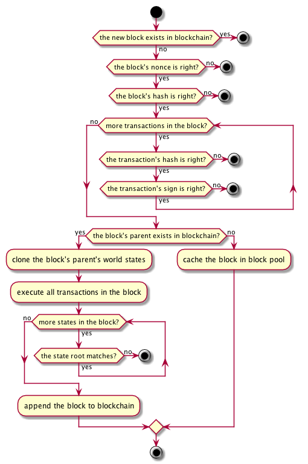

# Blockchain Design Doc

## Data Structure

``` txt
Block Structure
+---------------+----------------+
|  blockHeader  |  transactions  |
+---------------+----------------+

Block Header Structure
+--------+--------------+-------------+---------+------------+-------------+
|  hash  |  parentHash  |  stateRoot  |  nonce  |  coinbase  |  timestamp  |
+--------+--------------+-------------+---------+------------+-------------+
hash: sha3-256 hash, 256 bits
parentHash: sha3-256 hash, 256 bits
stateRoot: sha3-256 hash, 256 bits
nonce: uint64, 64 bits
coinbase: sha3-256 hash, 256 bits
timestamp: uint64, 64 bits. The number of nanoseconds elapsed since January 1, 1970 UTC.

Transaction Structure
+--------+--------+------+---------+---------+-------------+--------+-----------+
|  hash  |  from  |  to  |  value  |  nonce  |  timestamp  |  sign  |  payload  |
+--------+--------+------+---------+---------+-------------+--------+-----------+
hash: sha3-256 hash, 256 bits
from: sha3-256 hash, 256 bits
to: sha3-256 hash, 256 bits
value: uint128, bytes array
nonce: uint64, 64 bits
timestamp: int64, 64 bits. The number of seconds elapsed since January 1, 1970 UTC.
sign: bytes array
payload: bytes array
```

## Blockchain Update

In our opinion, **Blockchain** only needs to care about how to process new blocks to grow up safely and efficiently. What's more, **Blockchain** can only get new blocks in the following two channels.

**A new block from network**

Because of the unstable network latency, we cannot make sure any new block received can be linked to our current **Chain** directly. Thus, we need the **Blocks Pool** to cache new blocks.

**A new block from local miners**

At first, we need the **Transactions Pool** to cache transactions from network. Then, we wait for a new block created by local **Consensus** component, such as PoW. 

No matter where a new block comes from, we use the same steps to process it as following.



<!-- 
@startuml addBlockInPool

start

if (the new block exists in blockchain?) then (yes)
    stop
else (no)
    if (the block's nonce is right?) then (yes)
        if (the block's hash is right?) then (yes)
            while (more transactions in the block?) is (yes)
                if (the transaction's hash is right?) then (yes)
                    if (the transaction's sign is right?) then (yes)
                    else (no)
                        stop
                    endif
                else (no)
                    stop
                endif
            endwhile (no)
            if (the block's parent exists in blockchain?) then (yes)
                :clone the block's parent's world states;
                :execute all transactions in the block;
                while (more states in the block?) is (yes)
                    if (the state root matches?) then(yes)
                    else (no)
                        stop
                    endif
                endwhile (no)
                :append the block to blockchain;
            else (no)
                :cache the block in block pool;
            endif
        else (no)
            stop
        endif
    else (no)
        stop
    endif
endif

stop

@enduml 
-->

## World State

Every block contains the current world state, consist of following four states. They are all maintained as [Merkle Trees](./merkle_trie.md).

**Account State**

store all account states in current block

key, address; value, balance

**Transaction State(TBD)**

store all transaction data in current block

**Receipt State(TBD)**

store all events generated in the execution of all transactions in current block

**Rank State(TBD)**

store current rank result

## Serialization

We choose Protocol Buffer to do general serialization in consideration of the following benefits:

> - Large scale proven.
> - Efficiency. It omits key literals and use varints encoding.
> - Multi types and multilangue client support. Easy to use API.
> - Schema is good format for communication.
> - Schema is good for versioning/extension, i.e., adding new message fields or deprecating unused ones.

Specially, we use json to do serialization in smart contract codes instead of protobuf for the sake of readability.

## Sync

### Full Sync (TBD)

Here is a entire blockchain synchronization policy to be implemented.
We starts synchronization from the snapshot of the blockchain in local storage. All blocks generated after the snapshot will be synchronized from peers and replayed locally.

``` 
1. send my tail to remote peers and then find the common ancestor
2. the remote peers will return the common ancestor and 10 blocks after the common ancestor if exist
3. compare the common ancestors, if over n+1 are the same, suppose the ancestor is the right ancestor
4. find overlapping blocks in 10 blocks who has the same ancestors
5. give the overlapping blocks to block pool one by one, if return false, go to next sync
6. if all remote peers return the number of blocks less than 10, end sync
```
### Downloader
```
1. block_pool receive a block(new block) and found that can not link to parent.
2. compare the height fo tail block and the new block. if the tail block heigher than the new block, abandon the new block, else trigger a event of new block coming but can not link.
3. downloader will subscribe the event of new block coming but can not link. 
4. downloader go downloader from the node who send the new block.
```

### Fast Sync (TBD)

As for a light node, it needs a fast sync strategy to catch up the canonical chain.
