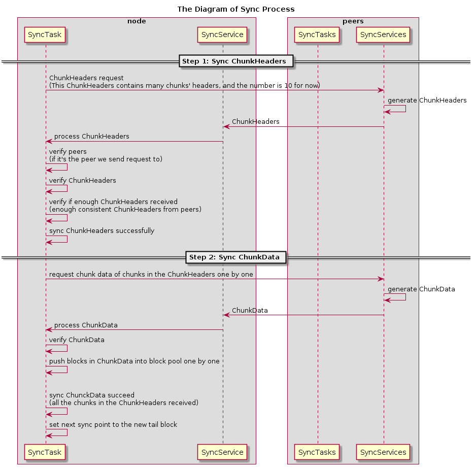
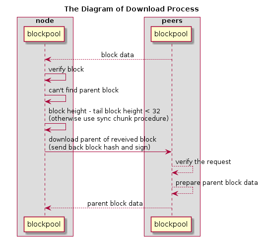

# Blockchain

## Model

Nebulas use accounts model instead of UTXO model.
The execution of transactions will consume gas.

## Data Structure

``` txt
Block Structure
+---------------+----------------+--------------+
|  blockHeader  |  transactions  |  dependency  |
+---------------+----------------+--------------+
blockHeader: header info
transactions: transactions array
dependency: the dependency relationship among transactions

Block Header Structure
+-----------+--------+--------------+------------+-------------+-------+--------+
|  chainid  |  hash  |  parentHash  |  coinbase  |  timestamp  |  alg  |  sign  |
+-----------+--------+--------------+------------+-------------+-------+--------+
+-------------+-----------+--------------+-----------------+
|  stateRoot  |  txsRoot  |  eventsRoot  |  consensusRoot  |
+-------------+-----------+--------------+-----------------+
chainid: chain identity the block belongs to
hash: block hash
parentHash: parent block hash
coinbase: account to receive the mint reward
timestamp: the number of nanoseconds elapsed since January 1, 1970 UTC
alg: the type of signature algorithm
sign: the signature of block hash
stateRoot: account state root hash
txsRoot: transactions state root hash
eventsRoot: events state root hash
consensusRoot: consensus state, including proposer and the dynasty of validators


Transaction Structure
+-----------+--------+--------+------+---------+---------+-------------+
|  chainid  |  hash  |  from  |  to  |  value  |  nonce  |  timestamp  |
+-----------+--------+--------+------+---------+---------+-------------+
+--------+------------+------------+
|  data  |  gasPrice  |  gasLimit  |
+--------+------------+------------+
chainid: chain identity the block belongs to
hash: transaction hash
from: sender's wallet address
to: receiver's wallet address
value: transfer value
nonce: transaction nonce
timestamp: the number of seconds elapsed since January 1, 1970 UTC
alg: the type of signature algorithm
sign: the signature of block hash
data: transaction data, including the type of transaction(binary transfer/deploy smart contracts/call smart contracts) and payload
gasPrice: the price of each gas consumed by the transaction
gasLimit: the max gas that can be consumed by the transaction
```

## Blockchain Update

In our opinion, **Blockchain** only needs to care about how to process new blocks to grow up safely and efficiently. What's more, **Blockchain** can only get new blocks in the following two channels.

### A new block from network

Because of the unstable network latency, we cannot make sure any new block received can be linked to our current **Chain** directly. Thus, we need the **Blocks Pool** to cache new blocks.

### A new block from local miner

At first, we need the **Transactions Pool** to cache transactions from network. Then, we wait for a new block created by local **Consensus** component, such as DPoS.

No matter where a new block comes from, we use the same steps to process it as following.


## World State

Every block contains the current world state, consist of following four states. They are all maintained as [Merkle Trees](./merkle_trie.md).

### Accounts State

All accounts in current block are stored in Accounts State.
Accounts are divided into two kinds, normal account & smart contract account.

Normal Account, including

- **wallet address**
- **balance**
- **nonce**: account's nonce, it will increment in steps of 1

Smart Contract Account， including

- **contract address**
- **balance**
- **birth place**: the transaction hash where the contract is deployed
- **variables**: contains all variables' values in the contract

### Transactions State

All transactions submitted on chain are storage in Transactions State.

### Events State

While transactions are executed, many events will be triggered.
All events triggered by transactions on chain are stored in Events State.

### Consensus State

The context of consensus algorithm is stored in consensus state.

As for DPoS, the consensus state includes

- **timestamp**: current slot of timestamp
- **proposer**: current proposer
- **dynasty**: current dynasty of validators

### Serialization

We choose Protocol Buffers to do general serialization in consideration of the following benefits:

- Large scale proven.
- Efficiency. It omits key literals and use varints encoding.
- Multi types and multilangue client support. Easy to use API.
- Schema is good format for communication.
- Schema is good for versioning/extension, i.e., adding new message fields or deprecating unused ones.

Specially, we use json to do serialization in smart contract codes instead of protobuf for the sake of readability.

## Synchronization

Sometimes a node will receive a block with height much higher than its current tail block. Then this node need to sync blocks from peer nodes to keep consistent with canonical chain.

The synchronization mechanism in nebulas contains two different procedure: sync chunks procedure and download blocks procedure. 
Which procedure to use depends on the number of blocks that need to be synchronized. 
If the blocks need to be synchronized is >32, then sync chunk procedure will be used. Otherwise the download block procedure will be used.

Sync chunk is a chunk-based synchronization procedure, which could minimize the number of network packets and achieve better safety. 
Each chunk contains 32 blocks on canonical chain. 
And chunks will be synced in ascending order (from older to newer).

Download blocks procedure is a synchronization procedure that download blocks one by one in a descending order (from newer to older).


### Sync Chunk

If a node A receives a block B with height higher than its current tail block by more than 32, then it will go through the sync chunk procedure.

During each sync chunk procedure a certain number of chunks will be synced. 
The number is defined by `MaxChunkPerSyncRequest` and it's 10 chunks for now. 

The sync chunk procedure is as following,

```txt
1. A sends its tail block to N remote peers.
2. The remote peers locate the chunk C that contains A's tail block.
   Then they will send back the headers of 10 chunks, including the chunk C and 9 C's subsequent chunks, and the hash H of the 10 headers.
3. If A receives >N/2 same hash H, A will try to sync the chunks represented by H.
4. If A has fetched all chunks represented by H and linked them on chain successfully, Jump to 1.
```
This procedure contain mainly two steps, sync ChunkHeaders (step 1-3) and sync ChunkData of the chunks included by the ChunkHeaders (step 4). 

**Note:** `ChunkHeader` contains an array of 32 block hash and the hash of these block hash. `ChunkHeaders` contains an array of 10 `ChunkHeader`s and the hash of these `ChunkHeader`s' hash.

This procedure will be repeated until the tail block height is 32 blocks less than the canonical chain, which means the remaining blocks is less than one chunk. Then the sync process will be finished. And the [downloader](https://github.com/nebulasio/wiki/blob/master/blockchain.md#downloader) process is used to get the remaining blocks.

Here is a diagram of this sync procedure:



### Download Block

If a node A receives a block B with height higher than its current tail block and the height difference is  <32, then it will go through the download block procedure.

During this procedure, the node A will try to download the B block's parent, the procedure is as following, 

```txt
1. A sends the hash of B back to the peer to download B's parent block.
2. If A received B's parent block B', A will try to link B' with A's current tail block. If failed again, B= B' & jump to 1. Otherwise, end.
```

This procedure will repeat until the parent block to be downloaded is the same with the tail block of node A, then the download process will be finished. And the block chain of node A will be the same with the canonical chain.

Here is a diagram of this download procedure:

