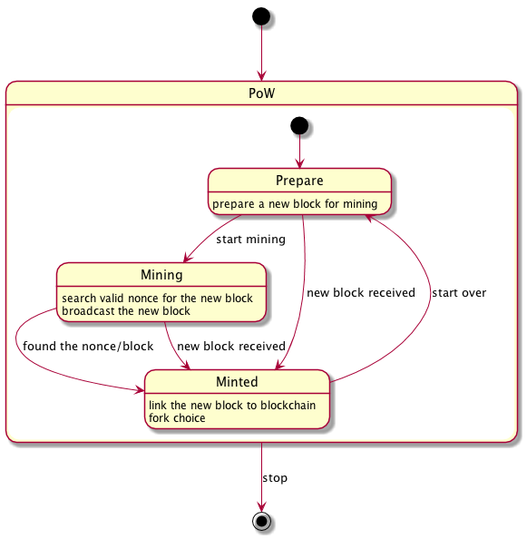

# Consensus Design Doc

We consider all consensus algorithms as state machines. States transitions are triggered by internal events or network message event as following.

## PoW (Proof-of-Work)

PoW(Proof-of-Work) Consensus Algorithm, similar as Bitcoin.

### State Machine

<!-- 
@startuml overview
[*] \-\-> PoW
state PoW {
    [*] \-\-> Prepare
    Prepare: prepare a new block for mining
    Prepare \-\-> Mining : start mining
    Prepare \-\-> Minted : new block received
    Mining: search valid nonce for the new block
    Mining: broadcast the new block
    Mining \-\-> Minted : found the nonce/block
    Mining \-\-> Minted : new block received
    Minted:
    Minted: link the new block to blockchain
    Minted: fork choice
    Minted \-\-> Prepare : start over
}
PoW \-\-> [*] : stop
@enduml
 -->

### Fork Choice

Always choose the longest chain as the canonical chain.

## PoD (Proof-of-Devotion)

> TODO: use PoD(Proof-of-Devotion, introduced in our [whitepaper](https://nebulas.io/docs/NebulasTechnicalWhitepaper.pdf)) instead.
