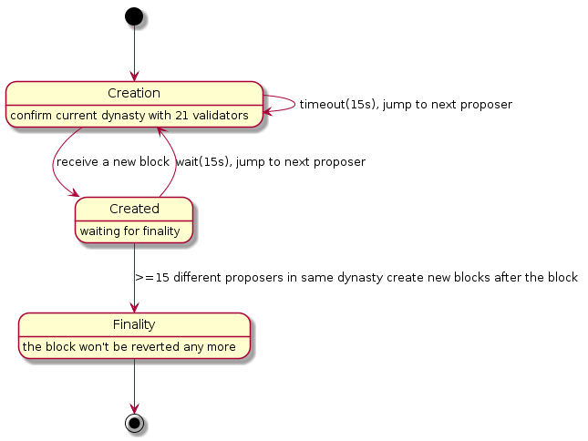

# Consensus

We think each consensus algorithm can be described as the combination of State Machine and Fork Choice Rules.

## DPoS(Delegate Proof-of-Stake)

> **Notice**
> For Nebulas, the primary consensus algorithm should be PoD, the DPoS algorithm is just a temporary solution. After the formal verification of PoD algorithm, we will transition mainnet to PoD. All witness (bookkeeper/miner) of DPoS are now accounts officially maintained by Nebulas. We will make sure a smooth transition from DPoS to PoD.
> We will create new funds to manage all the rewards of bookkeeping. And we will NOT sell those NAS on exchanges. All NAS will be used for building the Nebulas ecosystem, for example, rewarding DApp developers on Nebulas. And we will provide open access to all the spending of these rewards periodically.

As for the DPoS in Nebulas, it can also be decribed as a state machine.

### State Machine

### Fork Choice Rules

1. Always choose the longest chain as the canonical chain.
2. If A and B has the same length, we choose the one with smaller hash.

## PoD (Proof-of-Devotion)

Here is a draft of PoD. The research on PoD is ongoing [here](https://github.com/nebulasio/research/tree/master/pod).

### State Machine

### Fork Choice Rules

1. Always to choose the chain with highest sum of commit votes.
2. If A and B has the same length, we choose the one with smaller hash.
