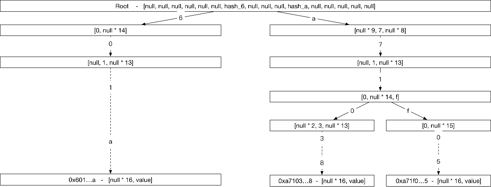
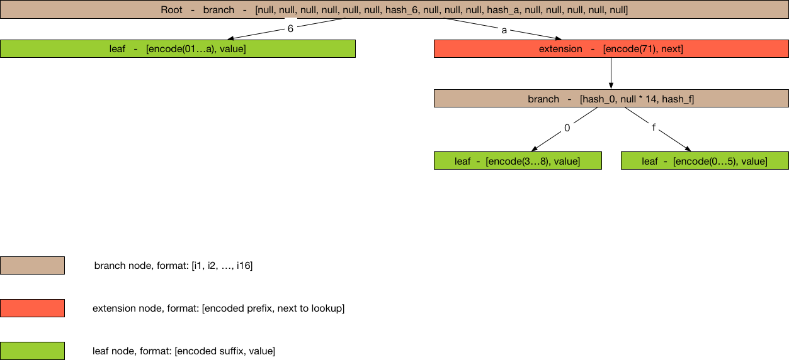
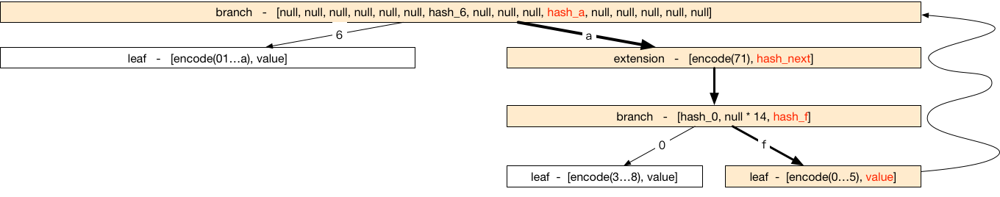

# Merkle Patricia Tree

## Basic: Radix Tree

> Reference: https://en.wikipedia.org/wiki/Radix_tree

A Radix Tree using address as the key looks like below:

- Addresses are represented as Hex Characters
- Each node in the Tree is a 16-elements array,  16 branch-slots(0123...def)
- leaf node: value can be any binary data carried by the address
- non-leaf node: value is the hash value calculated based on the children’s data

As for a 160-bits address, the max height of the tree is 40

**Problems:**
much space for a single entry
40 steps for each lookup

## Advanced: Merkle Patricia Tree

> Reference: https://github.com/ethereum/wiki/wiki/Patricia-Tree, http://gavwood.com/Paper.pdf

In order to reduce the storage of Radix Tree. The nodes in Merkle Patricia Tree are divided into three kinds,

- extension node: compress nodes using common prefix
- leaf node: compress nodes using unique suffix
- branch node: same as node in Radix Tree

## How to store Merkle Patricia Tree

**Key/Value Storage**

hash(value) = sha3(serialize(value))

key = hash(value)

## How to update Merkle Patricia Tree

**Query** 

DFS from top to bottom

**Update, Delete or Insert**

1.Query the node from top to bottom

2.update the hash along the path from bottom to top

**Performance**
Each operation costs O(log(n))

## How to verify using Merkle Patricia Tree

**Theorems**

1.Same merkle trees must have same root hash.

2.Different merkle trees must have different root hash.

Using the theorems, we can verify the result of the execution of transactions.

**Quick Verification**

A light client, without sync huge transactions, can immediately determine the exact balance and status of any account by simply asking the network for a path from the root to the account node.
