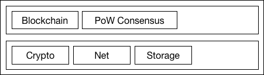

# Design Overview

> TODO: More features described in our [whitepaper](https://nebulas.io/docs/NebulasTechnicalWhitepaper.pdf), such as NVM, Smart Contracts, PoD, DIP and so on, will be integrated into the framework in later versions very soon.

## Core Dataflow

Here is a core workflow example to explain how Nebulas works in current version.
For each Nebulas node, it keeps receiving blocks or transactions from network and mining new block locally.

<!-- 
@startuml workflow

group new blocks from network
    -> Net: 1. receive a new block
    Net -> BlockPool: 2. feed it
    BlockPool -> Block: 3. verify its hash
    Block -> BlockPool: 4. right
    BlockPool -> Chain: 5. search its parent
    Chain -> BlockPool: 6. found
    BlockPool -> Block: 7. verify its states
    Block -> BlockPool: 8. right
    BlockPool -> Chain: 9. link it
end

group new transactions from network
    -> Net: 10. receive a new transaction
    Net -> TxsPool: 11. feed it
    TxsPool -> Transaction: 12. verify its sign
    Transaction -> TxsPool: 13. right
    TxsPool -> TxsPool: 14. cache it
end

group new blocks minted locally
    PoW -> TxsPool: 15. prepare transactions
    TxsPool -> PoW: 16. avaliable transactions
    PoW -> PoW: 11. mining
    PoW -> Net: 11. minted
    Net ->  BlockPool: 12. feed the new block
    Net -> : 13. broadcast new block
end

@enduml
-->

### Blocks from network

Once a new block received, the node will search the new block’s parent block in current chain. If not found, the new block will be cached in blocks pool. Otherwise, the node will try to execute all transactions in the block and then verify the new block's world state. If the new block is valid, it will be linked to current chain.

### Transactions from network

Once a new transaction received, the node will try to verify its sign. If the new transaction is valid, it will be cached in transactions pool.

### Blocks minted locally

Once a new block minted, the node will broadcast the new block to the network.

## More Details

[Blockchain Design Doc](./blockchain.md)

[Consensus Design Doc](./consensus.md)

[Crypto Design Doc](./crypto.md)

[Net Design Doc](./network_protocol.md)

[Smart Contract](./smart_contract.md)

[NVM](./nvm.md)

NR (TBD)

DIP (TBD)

[RPC](./rpc.md)
