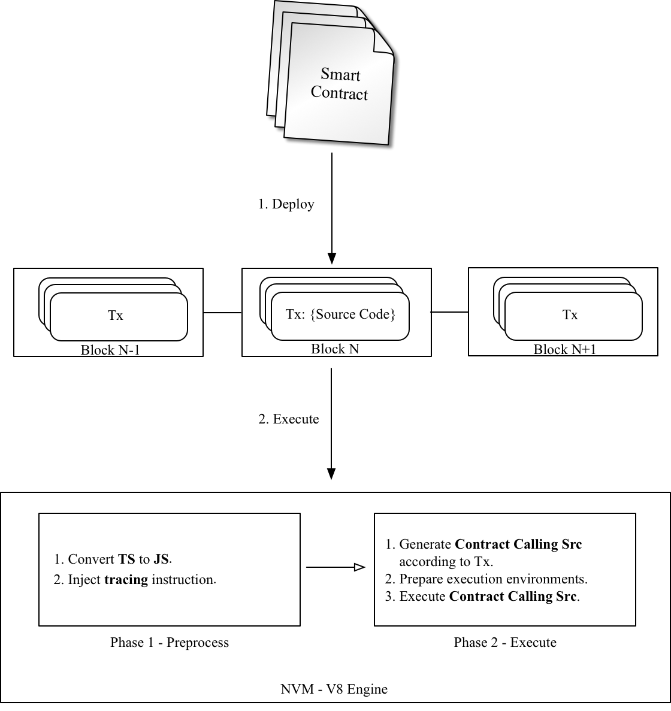

# Smart Contract （[中文版链接](https://github.com/nebulasio/wiki/blob/master/smart_contract_ch.md)）

## Languages

In Nebulas, there are two supported smart contract languages:
 - [JavaScript](https://en.wikipedia.org/wiki/JavaScript)
 - [TypeScript](https://en.wikipedia.org/wiki/TypeScript)

They are supported by the integration of [Chrome V8](https://developers.google.com/v8/), a widely used JavaScript engine developed by The Chromium Project for Google Chrome and Chromium web browsers.

## Execution Model

The diagram below is the Execution Model of Smart Contract:



1. All src of Smart Contract and arguments are packaged in Transaction and deployed on Nebulas.
2. The execution of Smart Contract are divided into two phases:
    1. Preprocess: inject tracing instruction, etc.
    2. Execute: generate executable src and execute it.

## Contracts

Contracts in Nebulas are similar to classes in object-oriented languages. They contain persistent data in state variables and functions that can modify these variables.


### Writing Contract

A contract must be a Prototype Object or Class in JavaScript or TypeScript.

A Contract must include an ```init``` function, it will be executed only once when deploying. Functions, named starting with ```_``` are ```private```, can't be executed in Transaction. The others are all ```public``` and can be executed in Transaction.

Since Contract is executed in Chrome V8, all instance variables are in memory, it's not wise to save all of them to [state trie](https://github.com/nebulasio/wiki/blob/master/merkle_trie.md) in Nebulas. In Nebulas, we provide ```LocalContractStorage``` and ```GlobalContractStorage``` objects to help developers define fields needing to be saved to state trie. And those fields should be defined in ```constructor``` of Contract, before other functions.

The following is a sample contract:

```javascript
class Rectangle {
    constructor() {
        // define fields stored to state trie.
        LocalContractStorage.defineProperties(this, {
            height: null,
            width: null,
        });
    }

    // init function.
    init(height, width) {
        this.height = height;
        this.width = width;
    }

    // calc area function.
    calcArea() {
        return this.height * this.width;
    }

    // verify function.
    verify(expected) {
        let area = this.calcArea();
        if (expected != area) {
            throw new Error("Error: expected " + expected + ", actual is " + area + ".");
        }
    }
}
```

### Visibility

In JavaScript, there is no function visibility, all functions defined in prototype object are public.

In Nebulas, we define two kinds of visibility ```public``` and ```private```:

* ```public```
All functions whose name matches regexp ```^[a-zA-Z$][A-Za-z0-9_$]*$``` are public, except ```init```. Public functions can be called via Transaction.

* ```private```
All functions whose name starts with ```_``` are private. A private function can only be called by public functions.

## Global Objects

### console

The ```console``` module provides a simple debugging console that is similar to the JavaScript console mechanism provided by web browsers.

The global console can be used without calling ```require('console')```.

#### console.info([...args])
* ```...args <any>```
The console.info() function is an alias for ```console.log()```.

#### console.log([...args])
* ```...args <any>```
Print ```args``` to Nebulas Logger at level ```info```.

#### console.debug([...args])
* ```...args <any>```
Print ```args``` to Nebulas Logger at level ```debug```.

#### console.warn([...args])
* ```...args <any>```
Print ```args``` to Nebulas Logger at level ```warn```.

#### console.error([...args])
* ```...args <any>```
Print ```args``` to Nebulas Logger at level ```error```.

### LocalContractStorage

The ```LocalContractStorage``` module provides a state trie based storage capability. It accepts string only key value pairs. And all data are stored to a private state trie associated with current contract address, only the contract can access them.

```typescript
interface Descriptor {
    // serialize value to string;
    stringify?(value: any): string;

    // deserialize value from string;
    parse?(value: string): any;
}

interface DescriptorMap {
    [fieldName: string]: Descriptor;
}

interface ContractStorage {
    // get and return value by key from Native Storage.
    rawGet(key: string): string;
    // set key and value pair to Native Storage,
    // return 0 for success, otherwise failure.
    rawSet(key: string, value: string): number;

    // define a object property named `fieldname` to `obj` with descriptor.
    // default descriptor is JSON.parse/JSON.stringify descriptor.
    // return this.
    defineProperty(obj: any, fieldName: string, descriptor?: Descriptor): any;

    // define object properties to `obj` from `props`.
    // default descriptor is JSON.parse/JSON.stringify descriptor.
    // return this.
    defineProperties(obj: any, props: DescriptorMap): any;

    // define a StorageMap property named `fieldname` to `obj` with descriptor.
    // default descriptor is JSON.parse/JSON.stringify descriptor.
    // return this.
    defineMapProperty(obj: any, fieldName: string, descriptor?: Descriptor): any;

    // define StorageMap properties to `obj` from `props`.
    // default descriptor is JSON.parse/JSON.stringify descriptor.
    // return this.
    defineMapProperties(obj: any, props: DescriptorMap): any;

    // delete key from Native Storage.
    // return 0 for success, otherwise failure.
    del(key: string): number;

    // get value by key from Native Storage,
    // deserialize value by calling `descriptor.parse` and return.
    get(key: string): any;

    // set key and value pair to Native Storage,
    // the value will be serialized to string by calling `descriptor.stringify`.
    // return 0 for success, otherwise failure.
    set(key: string, value: any): number;
}

interface StorageMap {
    // delete key from Native Storage, return 0 for success, otherwise failure.
    del(key: string): number;

    // get value by key from Native Storage,
    // deserialize value by calling `descriptor.parse` and return.
    get(key: string): any;

    // set key and value pair to Native Storage,
    // the value will be serialized to string by calling `descriptor.stringify`.
    // return 0 for success, otherwise failure.
    set(key: string, value: any): number;
}
```

### BigNumber

The `BigNumber` module use the [bignumber.js](https://github.com/MikeMcl/bignumber.js)(v4.1.0), a JavaScript library for arbitrary-precision decimal and non-decimal arithmetic. The contract can use `BigNumber` directly to handle the value of the transaction and other values transfer.

```js

var value = new BigNumber(0);
value.plus(1);
...
```

### Blockchain
The `Blockchain` module provides a object for contracts to obtain transactions and blocks executed by the current contract. Also, the NAS can be transferred from the contract and the address check is provided.

Blockchain API:

```js

// current block 
Blockchain.block;

// current transaction, transaction's value/gasPrice/gasLimit auto change to BigNumber object
Blockchain.transaction;

// transfer NAS from contract to address
Blockchain.transfer(address, value);

// verify address
Blockchain.verifyAddress(address);

```
properties:

- `block`: current block for contract execution
	- `timestamp`: block timestamp
	- `seed`: random seed
	- `height`: block height
- `transaction`: current transaction for contract execution
	- `hash`: transaction hash
	- `from`: transaction from address
	- `to`: transaction to address
	- `value`: transaction value, a BigNumber object for contract use
	- `nonce`: transaction nonce
	- `timestamp`: transaction timestamp
	- `gasPrice`: transaction gasPrice, a BigNumber object for contract use
	- `gasLimit`: transaction gasLimit, a BigNumber object for contract use
- `transfer(address, value)`: transfer NAS from contract to address
	- params:
		- `address`: nebulas address to receive NAS
		- `value`: transfer value, a BigNumber object. The unit is wei, only integer value is valid.
	- return (boolean value):
		- `true`: transfer success
		- `false`: transfer failed   
- `verifyAddress(address)`: verify address
	- params:
		- `address`: address need to check
	- return (number value):
		- `87`: user wallet address
		- `88`: smart-contract address
		- `0`: address is invalid 

Example to use:

```js

'use strict';

var SampleContract = function () {
    LocalContractStorage.defineProperties(this, {
        name: null,
        count: null
    });
    LocalContractStorage.defineMapProperty(this, "allocation");
};

SampleContract.prototype = {
    init: function (name, count, allocation) {
        this.name = name;
        this.count = count;
        allocation.forEach(function (item) {
            this.allocation.put(item.name, item.count);
        }, this);
        console.log('init: Blockchain.block.coinbase = ' + Blockchain.block.coinbase);
        console.log('init: Blockchain.block.hash = ' + Blockchain.block.hash);
        console.log('init: Blockchain.block.height = ' + Blockchain.block.height);
        console.log('init: Blockchain.transaction.from = ' + Blockchain.transaction.from);
        console.log('init: Blockchain.transaction.to = ' + Blockchain.transaction.to);
        console.log('init: Blockchain.transaction.value = ' + Blockchain.transaction.value);
        console.log('init: Blockchain.transaction.nonce = ' + Blockchain.transaction.nonce);
        console.log('init: Blockchain.transaction.hash = ' + Blockchain.transaction.hash);
    },
    transfer: function (address, value) {
        var result = Blockchain.transfer(address, value);
        console.log("transfer result:", result);
        Event.Trigger("transfer", {
			Transfer: {
				from: Blockchain.transaction.to,
				to: address,
				value: value
			}
		});
    },
    verifyAddress: function (address) {
    	 var result = Blockchain.verifyAddress(address);
        console.log("verifyAddress result:", result);
    }
};

module.exports = SampleContract;

```

### Event

The `Event` module records execution events in contract. The recorded events are stored in the event trie on the chain, which can be fetched by [`GetEventsByHash`](https://github.com/nebulasio/wiki/blob/master/rpc.md#geteventsbyhash)API with the execution transaction hash. All contract event topics have a `chain.contract.` prefix before the topic they set in contract.

```js
Event.Trigger(topic, obj);
```

 - `topic`: user-defined topic
 - `obj`: JSON object


You can see the example in `SampleContract` before.

### Math.random 
* `Math.random()` returns a floating-point, pseudo-random number in the range from 0 inclusive up to but not including 1. The typical usage is:

```js
"use strict";

var BankVaultContract = function () {};

BankVaultContract.prototype = {

	init: function () {},

	game: function(subscript){
	
		var arr =[1,2,3,4,5,6,7,8,9,10,11,12,13];

		for(var i = 0;i < arr.length; i++){
			var rand = parseInt(Math.random()*arr.length);
			var t = arr[rand];
			arr[rand] =arr[i];
			arr[i] = t;
		}

		return arr[parseInt(subscript)];
	},
};
module.exports = BankVaultContract;
```

* `Math.random.seed(myseed)` if needed, you can use this method to reset random seed. The argument `myseed` must be a **string**.
```js
"use strict";

var BankVaultContract = function () {};

BankVaultContract.prototype = {

	init: function () {},
	
	game:function(subscript, myseed){
	
		var arr =[1,2,3,4,5,6,7,8,9,10,11,12,13];
		
		console.log(Math.random());
	
		for(var i = 0;i < arr.length; i++){
		
			if (i == 8) {
				// reset random seed with `myseed`
				Math.random.seed(myseed);
			}

			var rand = parseInt(Math.random()*arr.length);
			var t = arr[rand];
			arr[rand] =arr[i];
			arr[i] = t;
		}
		return arr[parseInt(subscript)];
	},
};

module.exports = BankVaultContract;
```

### Date 
```js
"use strict";

var BankVaultContract = function () {};

BankVaultContract.prototype = {
	init: function () {},
	
	test: function(){
		var d = new Date();
		return d.toString();
	}
};

module.exports = BankVaultContract;
```
Tips:
* Unsupported methods：`toDateString()`, `toTimeString()`, `getTimezoneOffset()`, `toLocaleXXX()`.
* `new Date()`/`Date.now()` returns the timestamp of current block in milliseconds.
* `getXXX` returns the result of `getUTCXXX`.


### accept
this method is aimed to make it possible to send a binary transfer to a contract account. As the `to` is a smart contact address, which has declared a function `accept()` and it excutes correctly, the transfer will succeed. If the Tx is a non-binary Tx,it will be treated as a normal function.
```js
"use strict";
var DepositeContent = function (text) {
	if(text){
        	var o = JSON.parse(text);
        	this.balance = new BigNumber(o.balance);//余额信息
        	this.address = o.address;
	}else{
        	this.balance = new BigNumber(0);
        	this.address = "";
        }
};

DepositeContent.prototype = {
	toString: function () {
  		return JSON.stringify(this);
	}
};

var BankVaultContract = function () {
	LocalContractStorage.defineMapProperty(this, "bankVault", {
 		parse: function (text) {
  			return new DepositeContent(text);
 		},
 		stringify: function (o) {
  			return o.toString();
 		}
	});
};

BankVaultContract.prototype = {
	init: function () {},

	save: function () {
  		var from = Blockchain.transaction.from;
  		var value = Blockchain.transaction.value;
  		value = new BigNumber(value);
  		var orig_deposit = this.bankVault.get(from);
  		if (orig_deposit) {
    			value = value.plus(orig_deposit.balance);
  		}
		
  		var deposit = new DepositeContent();
  		deposit.balance = new BigNumber(value);
  		deposit.address = from;
  		this.bankVault.put(from, deposit);
	},

	accept:function(){
		this.save();
		Event.Trigger("transfer", {
			Transfer: {
				from: Blockchain.transaction.from,
				to: Blockchain.transaction.to,
				value: Blockchain.transaction.value,
			}
   		});
	}

};
module.exports = BankVaultContract;
```

### Call between contracts（be coming soon）

We provide a simple method in a smart contract to call another contract, the following example shows that how proxyKvStore provide service by using the contract kvStore.

proxyKvStore.js:
```js
"use strict"

var proxyKvStore = function() {
};

var contractInterface = {
    save: function(key value) {
    },
    get: function(key) {
    },
}


proxyKvStore.prototype = {
    init: function() {
        //
    },


    save: function(address, key, value) {

        var kvStore  = new Blockchain.Contract(address, contractInterface);
        kvStore.value(20000000000000000).save(key, value);
    },


    saveByCall: function(address, key, value) {

        var kvStore  = new Blockchain.Contract(address, contractInterface);

        var args = new Array();
        args[0] = key;
        args[1] = value;
        kvStore.value(20000000000000000).call('save', JSON.stringify(args));
    },


    get: function(address, key) {
        var kvStore = new Blockchain.Contract(address, contractInterface);
        return kvStore.get(key)
    },
}

module.exports = proxyKvStore;
```
kvStore.js:

```js
"use strict";

var item = function(text) {
  if (text) {
    var obj = JSON.parse(text);
    this.key = obj.key;
    this.value = obj.value;
    this.author = obj.text;
  } else {
      this.key = "";
      this.author = "";
      this.value = "";
  }
};

item.prototype = {
  toString: function () {
    return JSON.stringify(this);
  }
};

var kvStore = function () {
    LocalContractStorage.defineMapProperty(this, "repo", {
        parse: function (text) {
            return new item(text);
        },
        stringify: function (o) {
            return o.toString();
        }
    });
};

kvStore.prototype = {
    init: function () {
        // todo
    },

    save: function (key, value) {
        console.log("reach child contract");

        key = key.trim();
        value = value.trim();
        if (key === "" || value === ""){
            throw new Error("empty key / value");
        }
        if (value.length > 128 || key.length > 128){
            throw new Error("key / value exceed limit length")
        }

        var from = Blockchain.transaction.from;
        var item = this.repo.get(key);
    
        if (item){
            throw new Error("value has been taken");
        }

        item = new item();
        item.author = from;
        item.key = key;
        item.value = value;
        this.repo.put(key, item);
    },

    get: function (key) {
        key = key.trim();
        if ( key === "" ) {
            throw new Error("empty key")
        }
        return this.repo.get(key);
    }, 

    throwErr: function() {
        throw("err for test");
    }
};
module.exports = kvStore;
```

In the example, to use KvStore, we first should define an interface like this:

```js
var contractInterface = {
    save: function(key, value) {
    },
    get: function(key) {
    },
}
```
Then, create a contract object with the interface and the address of the contract you want to call:

```js
var kvStore  = new Blockchain.Contract(address, contractInterface);
```

After that, we can call function in KvStore.js thought this object:
```js
kvStore.value(2000000000000000000).save(key, value);
```
or
```js
kvStore.save(key, value);
```

as well as this way, keep the style of calling a function by sendRawTransaction RPC:

```js
kvStore.value(2000000000000000000).call('save', JSON.stringify(args));
```

the 'value' function decides how much nas will be transfered to callee contract. It is not necessary， and the default value is 0.

It should be noted that in the execution environment of the callee contract, Blockchain.from returns the address of the caller contract, and Blockchain.value is determined by the parameter of the 'value' function executed by the caller contract.
