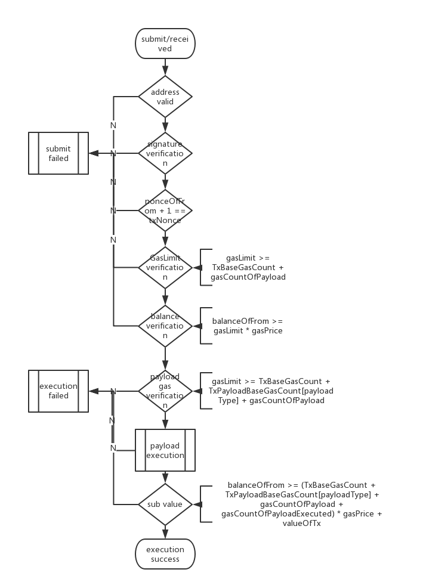

## Transaction Process Diagram

When a transaction is submitted, it is necessary to check the chain in the transaction. Transactions that are submitted externally or have been packaged into the block are somewhat different when doing validation.

#### New Transaction Process (from network, rpc)
Transactions submitted through an RPC or other node broadcast.

- Transaction pool Verification: gasPrice >= gasPriceOfTxPool & gasLimit <= gasLimitOfTxPool??; fail and drop;

- Next steps like Transaction in Block Process.

#### Transaction in Block Process
The transaction has been packaged into the block, and the transaction is verified after receiving the block.

- Address Verification: check whether fromAddr and/or toAddr is valid; (impl while deserialize from stream); fail and drop;
- Signature Verification: whether the sign is from fromAddr ??; fail and drop;
- Nonce Verification: nonceOfFrom +1 == nonceOfTx ??; fail and drop;
- GasLimit Verification: gasLimit >= TxBaseGasCount + gasCountOfPayload ??; fail and drop;
- From Balance Verification: balanceOfFrom >= gasLimit * gasPrice ??; fail and drop;
- Payload Gas Verification: gasLimit >= TxBaseGasCount + TxPayloadBaseGasCount[payloadType] + gasCountOfPayload ??; failed and consume gas (TxBaseGasCount + gasCountOfPayload) * gasPrice;
- Payload Execution: calculate gas ??; fail and consume gas (TxBaseGasCount + gasCountOfPayload + TxPayloadBaseGasCount[payloadType] + gasCountOfpayloadExecuted) * gasPrice;
- Sub Balance: balanceOfFrom >= (TxBaseGasCount + TxPayloadBaseGasCount[payloadType] + gasCountOfPayload + gasCountOfPayloadExecuted) * gasPrice + valueOfTx ?? ; fail and consume gas (TxBaseGasCount + gasCountOfPayload + TxPayloadBaseGasCount[payloadType] + gasCountOfpayloadExecuted) * gasPrice;

