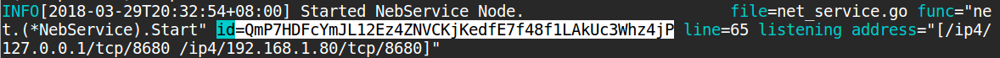

# Nebulas 101 - 01 Compile and Install Nebulas

[YouTube Tutorial](https://www.youtube.com/watch?v=85L07p_FWGY)

The project code for [Nebulas](https://nebulas.io/) has been released in several versions and tested to run locally. You can download the Nebulas source code to compile the private chain locally.

To learn about Nebulas, please read the Nebulas [Non-Technical White Paper](https://nebulas.io/docs/NebulasWhitepaper.pdf).

To learn about the technology, please read the Nebulas [Technical White Paper](https://nebulas.io/docs/NebulasTechnicalWhitepaper.pdf) and the Nebulas [github code](https://github.com/nebulasio/go-nebulas).

### Installing prerequisites
#### Install prerequisites on Linux (Ubuntu)
We'll install some basic tools needed for this guide:
```
sudo apt-get install git make wget
```

### Nebulas Environment Set Up

Nebulas is implemented using Go Language. Installing Golang develop environment is required. And the golang version should`>= 1.9`.

*NVM (Nebulas Virtual Machine) uses V8 JavaScript engine. As currently V8 only works on Mac and Linux, Nebulas can only runs on Mac and Linux at this stage. The Windows version will be coming soon.*

[Golang Installation](https://golang.org/doc/install)

#### Install Go Environment on Mac 
`brew` is recommended for installing golang on Mac. Please refer to [Homebrew](https://brew.sh/) to install`brew` .

Installation command:

```
brew install go
```

After installation, use `go env` to check version for Go


##### Setup golang project directory on Mac

The environment variables that need to be set after installation are: `GOPATH`,`GOBIN`. and then add `GOBIN` to `PATH`.

Find `.bash_profile` in path `Users/myUserName/.bash_profile`.
If the file is invisible then you need to open up terminal and type

```
defaults write com.apple.finder AppleShowAllFiles TRUE
```

Then you can find and edit `~/.bash_profile`.

Open up .bash_profile and add the code below:

```
    export GOPATH=<go path>
    export GOBIN=$GOPATH/bin
    export PATH=$PATH:$GOBIN
```


**Notice:GOPATH is a local golang working directory which could be decided by youself. After GOPATH is configured, your go projects need to be placed in GOPATH directory.**

 Save the changes to your .bash_profile file, and then restart the terminal: this is important to continue in the next step
 
#### Install Go Environment on Linux (Ubuntu)
See https://golang.org/doc/install
Download the golang archive

```
wget https://dl.google.com/go/go1.9.3.linux-amd64.tar.gz
```
 Extract it into /usr/local, creating a Go tree in /usr/local/go. For example: 
 
```
tar -C /usr/local -xzf go1.9.3.linux-amd64.tar.gz
```
Add /usr/local/go/bin to the PATH environment variable in your $HOME/.bashrc:

```
# Added for golang
export PATH=$PATH:/usr/local/go/bin
```
##### Setup golang project folders on linux (Ubuntu)
Create your project folder (Taking `$HOME/go` as an example, but you can basically put it anywhere you want)
```
mkdir -p $HOME/go/src
```

Set GOPATH in your $HOME/.bashrc (Make sure to replace <change_this_path> whith where you've put the project folder!)

```
export GOPATH=<change_this_path>/go
```

### Compile Nebulas

#### Download Source Code (Mac and Linux)：
Clone from GitHub (This tutorial uses [master](https://github.com/nebulasio/go-nebulas/tree/master))

```
git clone https://github.com/nebulasio/go-nebulas.git
git checkout master
```

**Note:** Don't forget to checkout to `master` branch, otherwise this tutorial might not work for you.

Since Go must be compiled in `$GOPATH`,  Nebulas code should be in `/src/github.com/nebulasio/go-nebulas` under `$GOPATH`。

**Note:** make sure you create a `src` folder and put `go-nebulas` inside it. The folder structure `github.com/nebulasio/go-nebulas` is just a suggestion.

#### Install rocksdb dependencies.

Please refer to [rocksdb](https://github.com/facebook/rocksdb/blob/master/INSTALL.md) for mor informatiom.

* **OS X**:
    * Install latest C++ compiler that supports C++ 11:
        * Update XCode:  run `xcode-select --install` (or install it from XCode App's settting).
        * Install via [homebrew](http://brew.sh/).
            * If you're first time developer in MacOS, you still need to run: `xcode-select --install` in your command line.
            * run `brew tap homebrew/versions; brew install gcc48 --use-llvm` to install gcc 4.8 (or higher).
    * run `brew install rocksdb`

* **Linux - Ubuntu**
    * Upgrade your gcc to version at least 4.8 to get C++11 support.
    
        To check your gcc version:  `gcc --version`
                                       
        TO Install gcc-4.9 :   `sudo apt-get install gcc-4.9`
    * Install gflags. First, try: 
    
        `sudo apt-get install libgflags-dev`
        
      If this doesn't work and you're using Ubuntu, here's a nice tutorial:
      (http://askubuntu.com/questions/312173/installing-gflags-12-04)
    * Install snappy. This is usually as easy as:
    
      `sudo apt-get install libsnappy-dev`.
    * Install zlib. Try: 
    
        `sudo apt-get install zlib1g-dev`.
    * Install bzip2: 
    
        `sudo apt-get install libbz2-dev`.
    * Install lz4: 
    
        `sudo apt-get install liblz4-dev`.
    * Install zstandard: 
    
        `sudo apt-get install libzstd-dev`.
    
#### Install Go Dependencies
Nebulas golang source code dependency is managered by [dep](https://github.com/golang/dep). Third-party packages used during development can be downloaded using dep.

##### Install dep for mac
Use `brew` to install `dep` on Mac:

```
$ brew install dep
$ brew upgrade dep
```
##### Install dep for linux
Install dep in /usr/local/bin so you can use it to download third-party packages

```
cd /usr/local/bin/
wget https://github.com/golang/dep/releases/download/v0.3.2/dep-linux-amd64
ln -s dep-linux-amd64 dep
```
##### Install dependencies for Mac/linux

Switch to the root directory of the project to install dependencies for Go:

```
cd <path>/go-nebulas
make dep
```

**PS: `make dep` downloads lots of dependencies. It might take a long time to download for the first time. Some dependencies may fail to download. If you can not download, you can directly download the zipped dependency files generated by dep [vendor.tar.gz](http://ory7cn4fx.bkt.clouddn.com/vendor.tar.gz) and extract it to the nebulas root directory.**

```
vendor.tar.gz
SHA1: caa012e74d78d4dd17704ba4a80f12b1ca5d799e
MD5: 1d1a6e1af57f6556ab6ec9647d0d8403
```

**PS: If it doesn’t work and you get an error:` validateParams: could not deduce external imports' project roots
make:[dep] Error 1.`
You should use a vpn and route all information through the vpn or export proxy in the terminal. For example; `export http_proxy=http://127.0.0.1:1087`; then try `make dep`**

#### Install V8 for Mac/linux

Nebulas's NVM (Nebulas Virtual Machine) uses the V8 JavaScript engine, and the `neb` could not run until V8 dependencies build for NVM is installed. The V8 dependencies provided by Mebulas incluses the dynamic link library `libnebulasv8.dylib` for Mac and the static link library` libnebulasv8.so` for Linux and other libraries. A make command is added in the project to install V8 dependency libraries. just run the installation command under the project root directory using the terminal:

```
cd go/src/github.com/go-nebulas
make deploy-v8
```

You can also install V8 dependencies separately if you don't want to use the dependencies integrated by `make`:
* On Mac:
```
install nf/nvm/native-lib/*.dylib /usr/local/lib/`
```
* On linux:
```
sudo install nf/nvm/native-lib/*.so /usr/local/lib/
sudo /sbin/ldconfig
```

#### Make Build for Mac/linux
You can now build the executable for Nebulas after golang dependencies and V8 dependency packages is installed.

Build under the project root directory:
```
cd go/src/github.com/go-nebulas
make build
```

**PS: if you get an error like `cannot find package`. Step 1: export proxy to terminal $ `export https_proxy=http://127.0.0.1:1087`. Step 2 `make dep` or `dep ensure`. Now you should be able to `make build`.**

Developers note: The Nebulas Go main function is in `cmd/neb/main.go`


Once the building is complete，there will be a executable file `neb` generated under the root directory.


## Build a local test environment

### Genesis block configuration

When launching the nebulas chain, the information of genesis block need to be configured. The block information will be initialized by **genesis block** configuration when the nebulas chain runs for the first time. At present, the nebula chain temporarily uses **DPOS** (Distributed Proof of Stake) as it's consensus algorithm. The initial mining members and the pre-allocation of NAS can be set in the genesis block configuration.

 **Genesis block configuration information:**

```
# Neb genesis text file. Scheme is defined in core/pb/genesis.proto.
#

meta {
  # chainID，private net is 100 by default ，Testnet is 1001
  chain_id: 100
}

consensus {
  # dpos Initial mining members
  dpos {
    dynasty: [
       "n1FF1nz6tarkDVwWQkMnnwFPuPKUaQTdptE",
       "n1GmkKH6nBMw4rrjt16RrJ9WcgvKUtAZP1s",
       "n1H4MYms9F55ehcvygwWE71J8tJC4CRr2so",
       "n1JAy4X6KKLCNiTd7MWMRsVBjgdVq5WCCpf",
       "n1LkDi2gGMqPrjYcczUiweyP4RxTB6Go1qS",
       "n1LmP9K8pFF33fgdgHZonFEMsqZinJ4EUqk"
    ]
  }
}

# NAS dispatch，
token_distribution [
  {
    address: "n1FF1nz6tarkDVwWQkMnnwFPuPKUaQTdptE"
    value: "10000000000000000000000"
  },
  {
    # If the first address goes to 0 then this address is used as a backup
    address: "n1GmkKH6nBMw4rrjt16RrJ9WcgvKUtAZP1s"
    value: "10000000000000000000000"
  }
]
```
The genesis configuration file is located in  `conf/default/genesis.conf` by default. This location could also be set in seed node configuration file.

### Nodes
Nebulas nodes could be started by exceuable file `neb`, which should be executed in terminal.
Neb nodes include **seed nodes** and ordinary **nodes**.

**Seed Node**: the  **seed node**  of Nebula chain network, which is used to provide initial synchronization services for other nodes;

**Node**: the ordinary **node** of Nebula chain. An ordinary node should sync routing and blocks information form seed node first after it's started.

Nebula chain seed nodes and nodes are distinguished by the configuration file. When starting nebulas nodes, the seed node need to be started first. After the seed node is started, you should to update the network address of the seed node into the configuration file of the ordinary nodes, and then they can be networked for mining.

### Review config.conf

Now we need to review the config.conf file which is located in `go-nebulas/conf/default/config.conf`

*This version of `config.conf` includes inline comments that are not included in the file in the go-nebulas repo.*

```
# Neb configuration text file. Scheme is defined in neblet/pb/config.proto:Config.
#

network {
  # If this is the seed node, configuration is not needed. The normal node needs the seed node seed
  # seed: "UNCOMMENT_AND_SET_SEED_NODE_ADDRESS"
  # p2p network service host. support mutiple ip and ports.
  listen: ["127.0.0.1:8680"]
  # the private key is used to generate a node ID. If you don't use the private key, the node will get a new ID.
  # private_key: "conf/network/id_ed25519"
}

chain {
  # Network chain ID. defult: 100
  chain_id: 100
  # Database storage location
  datadir: "data.db"
  # Node private key location
  keydir: "keydir"
  # The genesis block configuration
  genesis: "conf/default/genesis.conf"
  # Mining machine's mining address, the reward will be send to a Coinbase address
  coinbase: "n1FF1nz6tarkDVwWQkMnnwFPuPKUaQTdptE"
  # Node signature algorithm
  signature_ciphers: ["ECC_SECP256K1"]
  # Mining machine's mining address
  miner: "n1SAQy3ix1pZj8MPzNeVqpAmu1nCVqb5w8c"
  # The passphrase used to unlock account
  passphrase: "passphrase"
}

# Service configuration of interaction between user and node.
rpc {
    # GRPC API port
    rpc_listen: ["127.0.0.1:8684"]
    # HTTP API port
    http_listen: ["127.0.0.1:8685"]
    # The module that user can access by HTTP
    http_module: ["api","admin"]
}

# Configuration of log
app {
    # Log level {debug, info, warn, error, fatal}
    log_level: "info"
    # The output path of Log
    log_file: "logs"
    # Crash log enabling
    enable_crash_report: false
}

# Other Configuration
stats {
    # Node Metrics Enabling
    enable_metrics: false
    # Configuration of influxdb
    influxdb: {
        host: "http://localhost:8086"
        db: "nebulas"
        user: "admin"
        password: "admin"
    }
}

```

## Running your Node

### Starting a Seed Node

**Note: the Node network you are running at this point is private and is not connected to the Testnet**

The default command to start a seed node:

```
./neb
```

By default neb looks for a configuration file in `conf/default/config.conf` to start a seed node if no configuration file is specified.

If you are using a different configuration file than the default, add the `-c` flag at startup to specify the configuration file. For example, to specify a node configuration file when starting a seed node:

```
./neb -c <path>/new-config.conf
```

After starting, the following should be visible in the terminal:


### Starting a Node

After starting the seed node, if you need to start a normal node network connected with the seed node you must add the seed node address information in the normal node's configuration file.

Use this example configuration file `conf/example/miner.conf` to start a Node that is connected to the seed node you started above. Leave the seed node running, open another terminal window inside of the `go-nebulas` directory and run the following command:

```
./neb -c conf/example/miner.conf
```

After the node starts, if the connection with the seed node is successful, you can see the following log:


#### Creating your own Node config

**Note: this step is optional for this tutorial but is useful for better understanding how Nodes reference seed nodes.**

To create a Node that connects with your seed node you must create a config file that references the seed address.

The seed node `address` and `id` can be found from the seed node log printed on screen on the line which has words `Started NebService Node`. You can also find this information in log file which locates in folder `./logs/`



In the log above, the **address** is `/ip4/127.0.0.1/tcp/8680`, the **id** is `QmP7HDFcYmJL12Ez4ZNVCKjKedfE7f48f1LAkUc3Whz4jP `. The Nebulas p2p network uses IPFS's libp2p network library. The format of the seed address is:

```
<address>/ipfs/<id>
```

Now copy the configuration file `conf/default/config.conf` to `conf/my-node-config.conf` and ensure that the network block looks like the following:

```
network {
  # seed: "UNCOMMENT_AND_SET_SEED_NODE_ADDRESS"
  seed: ["/ip4/127.0.0.1/tcp/8680/ipfs/QmP7HDFcYmJL12Ez4ZNVCKjKedfE7f48f1LAkUc3Whz4jP"]
  listen: ["127.0.0.1:10001"]
}@
...
```
You can now run this node with:

```
./neb -c conf/my-node-config.conf
```

**Note: If configuring multiple nodes on the same machine, make sure to avoid port override**

In order to avoid port override ensure that the port `10001` in the network block above `listen: ["127.0.0.1:10001"]` is different for each node you start.

### Next step: Tutorial 2:

[Sending Transactions on Nebulas](https://github.com/nebulasio/wiki/blob/master/tutorials/%5BEnglish%5D%20Nebulas%20101%20-%2002%20Transaction.md)
