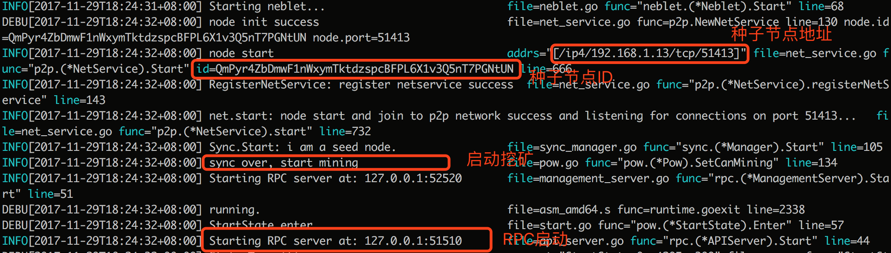
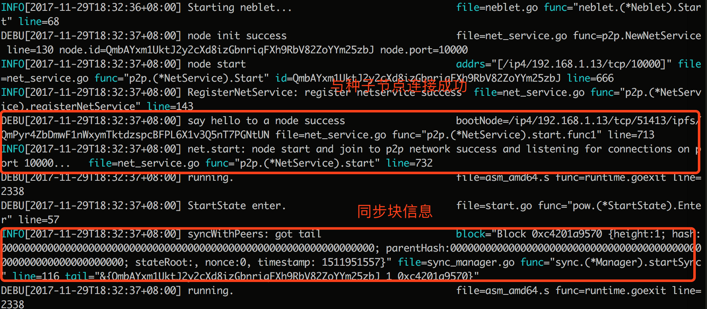

# Nebulas 101 - 01 Compile and Install Nebulas

The project code for [Nebulas](https://nebulas.io/) has been released in several versions and tested to run locally. You can download the Nebulas source code to compile the private chain locally.

To learn about Nebulas, please read the Nebulas [Non-Technical White Paper](https://nebulas.io/docs/NebulasWhitepaperZh.pdf).

To learn about the technology, please read the Nebulas [Technical White Paper](https://nebulas.io/docs/NebulasTechnicalWhitepaperZh.pdf) and the Nebulas [github code](https://github.com/nebulasio/go-nebulas).

## Nebulas Environment Set Up

Nebulas is implemented in Go Language. Installing Go Lang is required. Go Lang version `>=1.8`.

*NVM (Nebulas Virtual Machine) uses JavaScript v8 engine. As currently v8 only run on Mac and Linux versions, Nebulas can only run on Mac and Linux at this stage. The Windows version will be coming soon.*

[Go Lang Installation](https://golang.org/doc/install)

#### Install Go Environment on Mac
`brew` is recommended for installation. To install `brew`, pleace go to [homebrew](https://brew.sh/).

Installation command: ([Guide](http://www.jianshu.com/p/358cbc939569))

```
brew install go
```

After installation, use `go env` to check version for Go.

The environment variables that need to be set after installation are: `GOPATH`,`GOBIN`. Add `GOBIN` to `PATH`.

Edit `~/.bash_profile`:

```
    export GOPATH=/usr/local/Cellar/go/1.7.6
    export GOBIN=$GOPATH/bin
    export PATH=$PATH:$GOBIN
```

#### Install Go Environment on Linux：
It is recommended to install Go from source. Guide: [Go Installation on Linux](https://github.com/Unknwon/the-way-to-go_ZH_CN/blob/master/eBook/02.3.md)。

## Compile Nebulas

#### Download Source Code：
Clone from GitHub (This tutorial uses [v0.4.0](https://github.com/nebulasio/go-nebulas/tree/v0.4.0))

```
git clone -b v0.4.0 https://github.com/nebulasio/go-nebulas.git --depth=1
```

If you need the full commit history, clone all to local:

```
git clone https://github.com/nebulasio/go-nebulas.git
```
Since Go must compile in `$GOPATH`,  Nebulas code must be in `/src/github.com/nebulasio/go-nebulas` under `$GOPATH`。

#### Intall Go Dependencies

Nebulas' Go code dependency uses [dep](https://github.com/golang/dep). Third-party packages used in development can be downloaded using dep.

Use `brew` to install `dep`:

```
$ brew install dep
$ brew upgrade dep
```
Switch to the root directory of the project Install dependencies for Go:

```
cd <path>/go-nebulas
make dep
```
**PS: `make dep` downloads many dependencies. It would take a long time to download the first time. Some dependencies may fail to download. If you can not download, you can directly download the file generated by dep [vendor.tar.gz](http://ory7cn4fx.bkt.clouddn.com/vendor.tar.gz) and extract it to the code root directory.**

```
vendor.tar.gz
SHA1: a0417c109f35ddb78c97839dec6feb7212568aef
MD5: 0c261dafcb9cef477ced637323b4b309
```

#### Make Build

After completing the Go dependencies and v8 dependencies,  build for Nebulas. The Nebulas Go main function is in `cmd / neb / main.go`, run the make command to build:

```
make build
```

Once the build is complete，generate `neb` file at the root directory.


## Starting Node

#### Install V8

Nebulas's NVM (Nebulas Virtual Machine) uses JavaScript V8 engine, and the V8 dependencies for NVM need to be run with `neb` installed. The Mac version of the dynamic link library `libnebulasv8.dylib` and the Linux version of the static link library` libnebulasv8.so` and other so libraries are provided by the official V8 Dependency Library for Nebulas. A make command to install V8 dependency libraries has been added. Execute the installation command in the project root directory:

```
make deploy-v8
```

If you do not use make to integrate V8 link library, you can also install it separately:

* Mac
	* `install nf/nvm/native-lib/libnebulasv8.dylib /usr/local/lib/`
* Linux
	* `sudo install nf/nvm/native-lib/*.so /usr/local/lib/`
	* `sudo /sbin/ldconfig`

#### Node

Nebulas node can be started by executing the compiled `neb` executable. Node start needs to be executed on the terminal. Neb nodes include seed nodes and nodes:

* Seed node: Nebulas network seed node, to provide initial synchronization services for other nodes;
* Node: Nebulas network normal node, synchronize routing and block information from the seed node after starting.

Nebulas seed nodes and nodes are distinguished by the configuration files. The seed node needs to be started first before the node is started. After the seed node is started, update the network address information of the seed node to the configuration file of the normal node, and then you can do mining on the network.

#### Starting Seed Node

To start Nebulas nodes, some configuration parameters are needed provided by the configuration file. The configuration file uses [Protocol Buffer](https://github.com/google/protobuf) format to read the configuration information. Project root directory has the default seed node configuration file:

`config-seed.pb.txt`

Seed node configuration file:

```
# Node network configuration, configurations of seed node and node distiguishes here.
p2p {
  # If this is seed node, configuration is not needed. The normal node needs the seed node seed information to be configured.
  # seed: "UNCOMMENT_AND_SET_SEED_NODE_ADDRESS"
  # p2p network service port. Be sure to modify this when the same machine is starting multiple nodes, to prevent overriding
  port: 51413
  # Network chain ID. defult: 100
  chain_id: 100
  # Network protocol version. default: 1
  version: 1
}

# Service configuration of interaction between user and node. Be sure to modify the port when the same machine is starting multiple nodes, to prevent overriding
rpc {
  # gRPC API port, for user connection
  api_port: 51510
  # gRPC Management port, for admin
  management_port: 52520
  # HTTP API port, for user connection
  api_http_port: 8090
  # HTTP Management port, for admin
  management_http_port: 8191
}

# Mining machine mining configuration
pow {
  # Mining machine's mining address, the reward will be send to a Coinbase address
  coinbase: "8a209cec02cbeab7e2f74ad969d2dfe8dd24416aa65589bf"
}

# Nebulas Database Configuration
storage {
  # Database storage location
  location: "seed.db"
}

# Nebulas Account Configuration
account {
  # Node signature algorithm enumeration
  # keystore.SECP256K1 = 1
  signature: 1

  # Node encryption algorithm enumeration
  # keystore.SCRYPT = 1 << 4
  encrypt: 16

  # Node private key location
  key_dir: "keydir"

  test_passphrase: "passphrase"
}

# Node Metrics Database Configuration
influxdb {
  host: "http://localhost:8086"
  db: "nebulas"
  username: "test"
  password: "test"
}

# Node Metrics Enabling
metrics {
  enable: false
}

```

By default, `config-seed.pb.txt` in the root directory of the project is read to start seed node if no configuration file is specified. The default start seed node command:

```
./neb
```

If using different configuration file, just add the `-c` flag at startup to specify the configuration file. For example, to specify a node configuration file when starting a seed node:

```
./neb -c <path>/config-seed1.pb.txt
```

Node can be started after configuration file modification. After starting, the following would be in the terminal:


#### Starting Node

After starting the seed node, if you need to start a normal node network connected with the seed node, configure the seed node address information in the normal node configuration file. The seed node address can be found from the seed node log: **node start**:

```
time="2017-11-22T15:01:43+08:00" level=info msg="node start" addrs="[/ip4/192.168.1.13/tcp/51413]" file=net_service.go func="p2p.(*NetService).Start" id=QmPyr4ZbDmwF1nWxymTktdzspcBFPL6X1v3Q5nT7PGNtUN line=665

```
In the log above, the address information is `/ip4/192.168.1.13/tcp/51413`,id为`QmPyr4ZbDmwF1nWxymTktdzspcBFPL6X1v3Q5nT7PGNtUN `, Nebulas p2p network uses IPSF's libp2p network library. The format of the seed address:

```
<address>/ipfs/<id>
```
The configuration in the normal seed configuration file `config-normal.pb.txt`：

```
p2p {
  seed: "/ip4/192.168.1.13/tcp/51413/ipfs/QmPyr4ZbDmwF1nWxymTktdzspcBFPL6X1v3Q5nT7PGNtUN"
  port: 51415
}
...
```
**Note: If configuring multiple nodes on the same machine, make sure to avoid port override**

When starting an normal child node, use this configuration file to start the node:

```
./neb -c config-normal.pb.txt
```

After the node starts, if the connection with the seed node is successful, you can see the following log:


