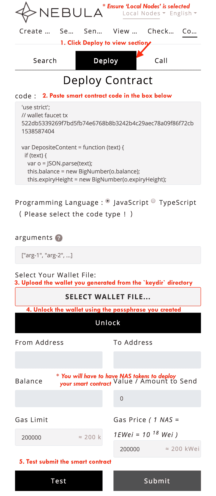

# Nebulas 101 - 03 Write and run a smart contract

[YouTube Tutorial](https://www.youtube.com/watch?v=98iW0WvajVU&index=2&list=PLFipfN18ZQwsW1_dge4w7dfsVNdNZZ37R)

In this tutorial we will learn how to write, deploy, and execute smart contracts in Nebulas.

## Preparation

Before starting to prepare the smart contract, first review the previously learned content:

1. Install, compile and start neb application
2. Create a wallet address, setup coinbase, and start mining
3. Query neb node information, wallet address, and balance
4. Send a transaction and verify the transaction was successful

If you have doubts about the above content you should reread the previous, relevant chapters.
So lets do this. We will learn how to use smart contracts through the following steps:

1. Write a smart contract
<<<<<<< HEAD
<<<<<<< c7256dcfda7a584d97247088ed33f60964ce28f8
2. Deploy the smart contract (via command-line or web-wallet)
3. Call the smart contract, and verify the contract execution results
=======
2. Deploy the smart contract
3. Call the smart contract, and verify the results of the contract execution
>>>>>>> fixes typos, grammar, and beautifies the docs
=======
2. Deploy the smart contract
3. Call the smart contract, and verify the results of the contract execution
>>>>>>> e7608a0196fd73e8674dbcfd8bafb4228a4465cd

## Write a smart contract

Like Ethereum, Nebulas implements Nebulas virtual machines (NVM) to run smart contracts, and the NVM implementation uses the JavaScript V8 engine, so for the current development we can write smart contracts using JavaScript and TypeScript.

Write a brief specification of a smart contract:

1. The Smart contract code must be a Prototype object;
2. The Smart contract code must have an init() method, this method will only be executed once during deployment;
3. The private methods in the smart contract must be prefixed with _ , and the private method cannot be a be directly called outside of the contract;

Below we use JavaScript to write the first smart contract: bank safe.
This smart contract needs to fulfill the following functions:

1. The user can deposit money to this bank safe.
2. Users can withdraw money from this bank safe.
3. Users can check the balance of the bank safe.

Smart contract example:

```js
'use strict';

var DepositeContent = function (text) {
  if (text) {
    var o = JSON.parse(text);
    this.balance = new BigNumber(o.balance);
    this.expiryHeight = new BigNumber(o.expiryHeight);
  } else {
    this.balance = new BigNumber(0);
    this.expiryHeight = new BigNumber(0);
  }
};

DepositeContent.prototype = {
  toString: function () {
    return JSON.stringify(this);
  }
};

var BankVaultContract = function () {
  LocalContractStorage.defineMapProperty(this, "bankVault", {
    parse: function (text) {
      return new DepositeContent(text);
    },
    stringify: function (o) {
      return o.toString();
    }
  });
};

// save value to contract, only after height of block, users can withdraw
BankVaultContract.prototype = {
  init: function () {
    //TODO:
  },

  save: function (height) {
    var from = Blockchain.transaction.from;
    var value = Blockchain.transaction.value;
    var bk_height = new BigNumber(Blockchain.block.height);

    var orig_deposit = this.bankVault.get(from);
    if (orig_deposit) {
      value = value.plus(orig_deposit.balance);
    }

    var deposit = new DepositeContent();
    deposit.balance = value;
    deposit.expiryHeight = bk_height.plus(height);

    this.bankVault.put(from, deposit);
  },

  takeout: function (value) {
    var from = Blockchain.transaction.from;
    var bk_height = new BigNumber(Blockchain.block.height);
    var amount = new BigNumber(value);

    var deposit = this.bankVault.get(from);
    if (!deposit) {
      throw new Error("No deposit before.");
    }

    if (bk_height.lt(deposit.expiryHeight)) {
      throw new Error("Can not takeout before expiryHeight.");
    }

    if (amount.gt(deposit.balance)) {
      throw new Error("Insufficient balance.");
    }

    var result = Blockchain.transfer(from, amount);
    if (!result) {
      throw new Error("transfer failed.");
    }
    Event.Trigger("BankVault", {
      Transfer: {
        from: Blockchain.transaction.to,
        to: from,
        value: amount.toString()
      }
    });

    deposit.balance = deposit.balance.sub(amount);
    this.bankVault.put(from, deposit);
  },
  balanceOf: function () {
    var from = Blockchain.transaction.from;
    return this.bankVault.get(from);
  },
  verifyAddress: function (address) {
    // 1-valid, 0-invalid
    var result = Blockchain.verifyAddress(address);
    return {
      valid: result == 0 ? false : true
    };
  }
};
module.exports = BankVaultContract;
```

As you can see from the smart contract example above, `BankVaultContract` is a prototype object that has an init() method. It satisfies the most basic specification for writing smart contracts that we have described before.
BankVaultContract implements two other methods:

- save(): The user can deposit money to the bank safe by calling the save() method;
- takeout(): Users can withdraw money from the bank safe by calling the takeout() method;
- balanceOf(): The user can check the balance of the bank vault by calling the balanceOf() method;

The contract code above uses the built-in `Blockchain` object and the built-in `BigNumber()` method. Let's break down the parsing contract code line by line:

**save():**

```js

// Deposit an amount to the safe

save: function (height) {
  var from = Blockchain.transaction.from;
  var value = Blockchain.transaction.value;
  var bk_height = new BigNumber(Blockchain.block.height);

  var orig_deposit = this.bankVault.get(from);
  if (orig_deposit) {
    value = value.plus(orig_deposit.balance);
  }
  var deposit = new DepositeContent();
  deposit.balance = value;
  deposit.expiryHeight = bk_height.plus(height);

  this.bankVault.put(from, deposit);
},
```

**takeout ():**

```js
takeout: function (value) {
  var from = Blockchain.transaction.from;
  var bk_height = new BigNumber(Blockchain.block.height);
  var amount = new BigNumber(value);

  var deposit = this.bankVault.get(from);
  if (!deposit) {
    throw new Error("No deposit before.");
  }

  if (bk_height.lt(deposit.expiryHeight)) {
    throw new Error("Can not takeout before expiryHeight.");
  }

  if (amount.gt(deposit.balance)) {
    throw new Error("Insufficient balance.");
  }

  var result = Blockchain.transfer(from, amount);
  if (!result) {
    throw new Error("transfer failed.");
  }
  Event.Trigger("BankVault", {
    Transfer: {
      from: Blockchain.transaction.to,
      to: from,
      value: amount.toString()
    }
  });

  deposit.balance = deposit.balance.sub(amount);
  this.bankVault.put(from, deposit);
},
```

## Deploy smart contracts using command line

<<<<<<< HEAD
<<<<<<< c7256dcfda7a584d97247088ed33f60964ce28f8
See next section to deploy using Web Wallet. The above describes how to write a smart contract in Nebulas, and now we need to deploy the smart contract to the chain.
Earlier, we have introduced how to make a transaction in Nebulas, and we used the sendTransaction() interface to initiate a transfer. Deploying a smart contract in Nebulas is actually achieved by sending a transaction by calling the sendTransaction() interface, just with different parameters.
=======
The above describes how to write a smart contract in Nebulas, and now we need to deploy the smart contract to the chain.
Earlier, we introduced how to make a transaction in Nebulas, and we used the sendTransaction() interface to initiate a transfer. Deploying a smart contract in Nebulas is actually achieved by sending a transaction by calling the sendTransaction() interface, just with different parameters.
>>>>>>> fixes typos, grammar, and beautifies the docs
=======
The above describes how to write a smart contract in Nebulas, and now we need to deploy the smart contract to the chain.
Earlier, we introduced how to make a transaction in Nebulas, and we used the sendTransaction() interface to initiate a transfer. Deploying a smart contract in Nebulas is actually achieved by sending a transaction by calling the sendTransaction() interface, just with different parameters.
>>>>>>> e7608a0196fd73e8674dbcfd8bafb4228a4465cd

```js
// transaction - from, to, value, nonce, gasPrice, gasLimit, contract
sendTransactionWithPassphrase(transaction, passphrase)
```

We have a convention that if `from` and `to` are the same address, `contract` is not null and `binary` is null, we assume that we are deploying a smart contract.

- `from`: the creator's address
- `to`: the creator's address
- `value`: it should be `"0"` when deploying the contract;
- `nonce`: it should be 1 more than the current nonce in the creator's account state, which can ben obtained via [`GetAccountState`](https://github.com/nebulasio/wiki/blob/master/rpc.md#getaccountstate).
- `gasPrice`: the gasPrice used to deploy the smart contract, which can be obtained via [`GetGasPrice`](https://github.com/nebulasio/wiki/blob/master/rpc.md#getgasprice), or using default values: `"1000000"`;
- `gasLimit`: the gasLimit for deploying the contract. You can get the estimated gas consumption for the deployment via [`EstimateGas`](https://github.com/nebulasio/wiki/blob/master/rpc.md#estimateGas), and cannot use the default value. You could also set a larger value. The actual gas consumption is decided by the deployment execution.
- `contract`: the contract information, the parameters passed when the contract is deployed
  - `source`: contract code
  - `sourceType`: contract code type, `js` and `ts` (corresponding to the javaScript and typeScript code respectively)
  - `args`: parameters for the contract initialization method. Use an empty string if there is no parameter, and use a JSON array if there is a parameter.

Detailed Interface Documentation [API](https://github.com/nebulasio/wiki/blob/master/rpc_admin.md#sendtransactionwithpassphrase).

Example of deploying a smart contract using curl:

```bash

> curl -i -H 'Accept: application/json' -X POST http://localhost:8685/v1/admin/transactionWithPassphrase -H 'Content-Type: application/json' -d '{"transaction": {"from":"n1H4MYms9F55ehcvygwWE71J8tJC4CRr2so","to":"n1H4MYms9F55ehcvygwWE71J8tJC4CRr2so", "value":"0","nonce":1,"gasPrice":"1000000","gasLimit":"2000000","contract":{"source":"\"use strict\";var DepositeContent=function(text){if(text){var o=JSON.parse(text);this.balance=new BigNumber(o.balance);this.expiryHeight=new BigNumber(o.expiryHeight);}else{this.balance=new BigNumber(0);this.expiryHeight=new BigNumber(0);}};DepositeContent.prototype={toString:function(){return JSON.stringify(this);}};var BankVaultContract=function(){LocalContractStorage.defineMapProperty(this,\"bankVault\",{parse:function(text){return new DepositeContent(text);},stringify:function(o){return o.toString();}});};BankVaultContract.prototype={init:function(){},save:function(height){var from=Blockchain.transaction.from;var value=Blockchain.transaction.value;var bk_height=new BigNumber(Blockchain.block.height);var orig_deposit=this.bankVault.get(from);if(orig_deposit){value=value.plus(orig_deposit.balance);} var deposit=new DepositeContent();deposit.balance=value;deposit.expiryHeight=bk_height.plus(height);this.bankVault.put(from,deposit);},takeout:function(value){var from=Blockchain.transaction.from;var bk_height=new BigNumber(Blockchain.block.height);var
 amount=new BigNumber(value);var deposit=this.bankVault.get(from);if(!deposit){throw new Error(\"No deposit before.\");} if(bk_height.lt(deposit.expiryHeight)){throw new Error(\"Can not takeout before expiryHeight.\");} if(amount.gt(deposit.balance)){throw new Error(\"Insufficient balance.\");} var result=Blockchain.transfer(from,amount);if(!result){throw new Error(\"transfer failed.\");} Event.Trigger(\"BankVault\",{Transfer:{from:Blockchain.transaction.to,to:from,value:amount.toString()}});deposit.balance=deposit.balance.sub(amount);this.bankVault.put(from,deposit);},balanceOf:function(){var from=Blockchain.transaction.from;return this.bankVault.get(from);},verifyAddress:function(address){var result=Blockchain.verifyAddress(address);return{valid:result==0?false:true};}};module.exports=BankVaultContract;","sourceType":"js", "args":""}}, "passphrase": "passphrase"}'

{"result":{"txhash":"aaebb86d15ca30b86834efb600f82cbcaf2d7aaffbe4f2c8e70de53cbed17889","contract_address":"n1rVLTRxQEXscTgThmbTnn2NqdWFEKwpYUM"}}
```

The return value for deploying a smart contract is the transaction's hash address `txhash`, and the contract's deployment address is `contract_address`.
Getting the return value does not guarantee a successful deployment of the contract, because sendTransaction () is an asynchronous process, which needs to be packaged by the miner. Just as the previous transfer transaction, the transfer does not arrive in real time, it depends on the speed of the miner packing. Therefore we need to wait for a while (about 1 minute), then you can verify whether the contract was deployed successfully by querying the contract address or calling this smart contract.

> **Verify if the deployment of the contract was successful**
>
> Check the receipt of the deployment transaction via [`GetTransactionReceipt`](https://github.com/nebulasio/wiki/blob/master/rpc.md#gettransactionreceipt) to verify whether the contract has been deployed successfully.
> ```bash
> > curl -i -H 'Content-Type: application/json' -X POST http://localhost:8685/v1/user/getTransactionReceipt -d '{"hash":"aaebb86d15ca30b86834efb600f82cbcaf2d7aaffbe4f2c8e70de53cbed17889"}'
>
> {"result":{"hash":"aaebb86d15ca30b86834efb600f82cbcaf2d7aaffbe4f2c8e70de53cbed17889","chainId":100,"from":"n1H4MYms9F55ehcvygwWE71J8tJC4CRr2so","to":"n1H4MYms9F55ehcvygwWE71J8tJC4CRr2so","value":"0","nonce":"1","timestamp":"1524711841","type":"deploy","data":"eyJTb3VyY2VUeXBlIjoianMiLCJTb3VyY2UiOiJcInVzZSBzdHJpY3RcIjt2YXIgRGVwb3NpdGVDb250ZW50PWZ1bmN0aW9uKHRleHQpe2lmKHRleHQpe3ZhciBvPUpTT04ucGFyc2UodGV4dCk7dGhpcy5iYWxhbmNlPW5ldyBCaWdOdW1iZXIoby5iYWxhbmNlKTt0aGlzLmV4cGlyeUhlaWdodD1uZXcgQmlnTnVtYmVyKG8uZXhwaXJ5SGVpZ2h0KTt9ZWxzZXt0aGlzLmJhbGFuY2U9bmV3IEJpZ051bWJlcigwKTt0aGlzLmV4cGlyeUhlaWdodD1uZXcgQmlnTnVtYmVyKDApO319O0RlcG9zaXRlQ29udGVudC5wcm90b3R5cGU9e3RvU3RyaW5nOmZ1bmN0aW9uKCl7cmV0dXJuIEpTT04uc3RyaW5naWZ5KHRoaXMpO319O3ZhciBCYW5rVmF1bHRDb250cmFjdD1mdW5jdGlvbigpe0xvY2FsQ29udHJhY3RTdG9yYWdlLmRlZmluZU1hcFByb3BlcnR5KHRoaXMsXCJiYW5rVmF1bHRcIix7cGFyc2U6ZnVuY3Rpb24odGV4dCl7cmV0dXJuIG5ldyBEZXBvc2l0ZUNvbnRlbnQodGV4dCk7fSxzdHJpbmdpZnk6ZnVuY3Rpb24obyl7cmV0dXJuIG8udG9TdHJpbmcoKTt9fSk7fTtCYW5rVmF1bHRDb250cmFjdC5wcm90b3R5cGU9e2luaXQ6ZnVuY3Rpb24oKXt9LHNhdmU6ZnVuY3Rpb24oaGVpZ2h0KXt2YXIgZnJvbT1CbG9ja2NoYWluLnRyYW5zYWN0aW9uLmZyb207dmFyIHZhbHVlPUJsb2NrY2hhaW4udHJhbnNhY3Rpb24udmFsdWU7dmFyIGJrX2hlaWdodD1uZXcgQmlnTnVtYmVyKEJsb2NrY2hhaW4uYmxvY2suaGVpZ2h0KTt2YXIgb3JpZ19kZXBvc2l0PXRoaXMuYmFua1ZhdWx0LmdldChmcm9tKTtpZihvcmlnX2RlcG9zaXQpe3ZhbHVlPXZhbHVlLnBsdXMob3JpZ19kZXBvc2l0LmJhbGFuY2UpO30gdmFyIGRlcG9zaXQ9bmV3IERlcG9zaXRlQ29udGVudCgpO2RlcG9zaXQuYmFsYW5jZT12YWx1ZTtkZXBvc2l0LmV4cGlyeUhlaWdodD1ia19oZWlnaHQucGx1cyhoZWlnaHQpO3RoaXMuYmFua1ZhdWx0LnB1dChmcm9tLGRlcG9zaXQpO30sdGFrZW91dDpmdW5jdGlvbih2YWx1ZSl7dmFyIGZyb209QmxvY2tjaGFpbi50cmFuc2FjdGlvbi5mcm9tO3ZhciBia19oZWlnaHQ9bmV3IEJpZ051bWJlcihCbG9ja2NoYWluLmJsb2NrLmhlaWdodCk7dmFyIGFtb3VudD1uZXcgQmlnTnVtYmVyKHZhbHVlKTt2YXIgZGVwb3NpdD10aGlzLmJhbmtWYXVsdC5nZXQoZnJvbSk7aWYoIWRlcG9zaXQpe3Rocm93IG5ldyBFcnJvcihcIk5vIGRlcG9zaXQgYmVmb3JlLlwiKTt9IGlmKGJrX2hlaWdodC5sdChkZXBvc2l0LmV4cGlyeUhlaWdodCkpe3Rocm93IG5ldyBFcnJvcihcIkNhbiBub3QgdGFrZW91dCBiZWZvcmUgZXhwaXJ5SGVpZ2h0LlwiKTt9IGlmKGFtb3VudC5ndChkZXBvc2l0LmJhbGFuY2UpKXt0aHJvdyBuZXcgRXJyb3IoXCJJbnN1ZmZpY2llbnQgYmFsYW5jZS5cIik7fSB2YXIgcmVzdWx0PUJsb2NrY2hhaW4udHJhbnNmZXIoZnJvbSxhbW91bnQpO2lmKCFyZXN1bHQpe3Rocm93IG5ldyBFcnJvcihcInRyYW5zZmVyIGZhaWxlZC5cIik7fSBFdmVudC5UcmlnZ2VyKFwiQmFua1ZhdWx0XCIse1RyYW5zZmVyOntmcm9tOkJsb2NrY2hhaW4udHJhbnNhY3Rpb24udG8sdG86ZnJvbSx2YWx1ZTphbW91bnQudG9TdHJpbmcoKX19KTtkZXBvc2l0LmJhbGFuY2U9ZGVwb3NpdC5iYWxhbmNlLnN1YihhbW91bnQpO3RoaXMuYmFua1ZhdWx0LnB1dChmcm9tLGRlcG9zaXQpO30sYmFsYW5jZU9mOmZ1bmN0aW9uKCl7dmFyIGZyb209QmxvY2tjaGFpbi50cmFuc2FjdGlvbi5mcm9tO3JldHVybiB0aGlzLmJhbmtWYXVsdC5nZXQoZnJvbSk7fSx2ZXJpZnlBZGRyZXNzOmZ1bmN0aW9uKGFkZHJlc3Mpe3ZhciByZXN1bHQ9QmxvY2tjaGFpbi52ZXJpZnlBZGRyZXNzKGFkZHJlc3MpO3JldHVybnt2YWxpZDpyZXN1bHQ9PTA/ZmFsc2U6dHJ1ZX07fX07bW9kdWxlLmV4cG9ydHM9QmFua1ZhdWx0Q29udHJhY3Q7IiwiQXJncyI6IiJ9","gas_price":"1000000","gas_limit":"2000000","contract_address":"n1rVLTRxQEXscTgThmbTnn2NqdWFEKwpYUM","status":1,"gas_used":"22016"}}
> ```
> As shown above, the status of the deployment transaction becomes 1. It means the contract has been deployed successfully.
<<<<<<< HEAD

## Deploy smart contracts using web wallet

Alternatively to sending your smart contract code using the curl command, you can copy and paste the code into a web interface locally. First you will need the interface web-wallet so clone the repo `https://github.com/nebulasio/web-wallet` outside your `go-nebulas` repo. Then you will need to run `node server.js` in a terminal window. This will allow you to open your browser to see the web-wallet interface running on `127.0.0.1:8080/contract.html`. Here are the exact steps:

- `git clone https://github.com/nebulasio/web-wallet`
- `cd web-wallet && node server.js`
- open `127.0.0.1:8080/contract.html`

In the screenshot below you can see the steps to deploy your smart contract code:
- Select network for deployment (local, testnet, mainnet)
- Select `Deploy` section
- Paste your code in the code input box
- Select your wallet file, default location is the `keydir` directory
- Unlock your wallet with the passphrase you created
- To get gas for your wallet on the testnet visit (https://testnet.nebulas.io/claim/)[https://testnet.nebulas.io/claim/]
- Click the `Test` or `Submit` button


=======
>>>>>>> e7608a0196fd73e8674dbcfd8bafb4228a4465cd

## Execute Smart Contract Method

The way to execute a smart contract method in Nebulas is also straightforward, using the sendTransactionWithPassphrase() method to invoke the smart contract method directly.

```js
// transaction - from, to, value, nonce, gasPrice, gasLimit, contract
sendTransactionWithPassphrase(transaction, passphrase)
```

- `from`: the user's account address
- `to`: the smart contract address
- `value`: the amount of money used to transfer by smart contract.
- `nonce`: it should be 1 more than the current nonce in the creator's account state, which can ben obtained via [`GetAccountState`](https://github.com/nebulasio/wiki/blob/master/rpc.md#getaccountstate).
- `gasPrice`: the gasPrice used to deploy the smart contract, which can be obtained via [`GetGasPrice`](https://github.com/nebulasio/wiki/blob/master/rpc.md#getgasprice), or using default values `"1000000"`;
- `gasLimit`: the gasLimit for deploying the contract. You can get the estimated gas consumption for the deployment via [`EstimateGas`](https://github.com/nebulasio/wiki/blob/master/rpc.md#estimateGas), and cannot use the default value. You could also set a larger value. The actual gas consumption is decided by the deployment execution.
- `contract`: the contract information, the parameters passed in when the contract is deployed
  - `function`: the contract method to be called
  - `args`: parameters for the contract initialization method. Use an empty string if there is no parameter, and use a JSON array if there is a parameter.

For example, execute the save() method of the smart contract:

```bash
> curl -i -H 'Accept: application/json' -X POST http://localhost:8685/v1/admin/transactionWithPassphrase -H 'Content-Type: application/json' -d '{"transaction":{"from":"n1LkDi2gGMqPrjYcczUiweyP4RxTB6Go1qS","to":"n1rVLTRxQEXscTgThmbTnn2NqdWFEKwpYUM", "value":"100","nonce":1,"gasPrice":"1000000","gasLimit":"2000000","contract":{"function":"save","args":"[0]"}}, "passphrase": "passphrase"}'

{"result":{"txhash":"5337f1051198b8ac57033fec98c7a55e8a001dbd293021ae92564d7528de3f84","contract_address":""}}
```

> **Verify if the execution of the contract method `save` was successful**
> Executing a contract method is actually submitting a transaction on chain as well. We can verify the result through checking the receipt of the transaction via [`GetTransactionReceipt`](https://github.com/nebulasio/wiki/blob/master/rpc.md#gettransactionreceipt).
> ```bash
> > curl -i -H 'Content-Type: application/json' -X POST http://localhost:8685/v1/user/getTransactionReceipt -d '{"hash":"5337f1051198b8ac57033fec98c7a55e8a001dbd293021ae92564d7528de3f84"}'
>
> {"result":{"hash":"5337f1051198b8ac57033fec98c7a55e8a001dbd293021ae92564d7528de3f84","chainId":100,"from":"n1LkDi2gGMqPrjYcczUiweyP4RxTB6Go1qS","to":"n1rVLTRxQEXscTgThmbTnn2NqdWFEKwpYUM","value":"100","nonce":"1","timestamp":"1524712532","type":"call","data":"eyJGdW5jdGlvbiI6InNhdmUiLCJBcmdzIjoiWzBdIn0=","gas_price":"1000000","gas_limit":"2000000","contract_address":"","status":1,"gas_used":"20361"}}
> ```
> As shown above, the status of the transaction becomes 1. It means the contract method has been executed successfully.

Execute the smart contract’s takeout() method:

```bash
> curl -i -H 'Accept: application/json' -X POST http://localhost:8685/v1/admin/transactionWithPassphrase -H 'Content-Type: application/json' -d '{"transaction":{"from":"n1LkDi2gGMqPrjYcczUiweyP4RxTB6Go1qS","to":"n1rVLTRxQEXscTgThmbTnn2NqdWFEKwpYUM", "value":"0","nonce":2,"gasPrice":"1000000","gasLimit":"2000000","contract":{"function":"takeout","args":"[50]"}}, "passphrase": "passphrase"}'

{"result":{"txhash":"46a307e9beb21f52992a7512f3705fe58ee6c1887122a1b52f5ce5fd5f536a91","contract_address":""}}
```

> **Verify if the execution of the contract’s method `takeout` was successful**
> In the execution of the above contract method `save`, we deposited 100  wei (10^-18 NAS) to the smart contract `n1rVLTRxQEXscTgThmbTnn2NqdWFEKwpYUM`. Using the contract method `takeout`, we will withdraw 50 wei from 100 wei. The balance of the smart contract should be 50 wei now.
> ```bash
> > curl -i -H 'Content-Type: application/json' -X POST http://localhost:8685/v1/user/accountstate -d '{"address":"n1rVLTRxQEXscTgThmbTnn2NqdWFEKwpYUM"}'
>
> {"result":{"balance":"50","nonce":"0","type":88}}
> ```
> The result is as expected.

## Query Smart Contract Data

In a smart contract, the execution of some methods won't change anything on chain. These methods are designed to help us query data in read-only mode from blockchains. In Nebulas, we provide an API `call` for users to execute these read-only methods.

```js
// transaction - from, to, value,
 nonce, gasPrice, gasLimit, contract
call(from, to, value, nonce, gasPrice, gasLimit, contract)
```

The parameters of `call` are the same as the parameters of executing a contract method.

Call the smart contract method `balanceOf`:

```bash
> curl -i -H 'Accept: application/json' -X POST http://localhost:8685/v1/user/call -H 'Content-Type: application/json' -d '{"from":"n1LkDi2gGMqPrjYcczUiweyP4RxTB6Go1qS","to":"n1rVLTRxQEXscTgThmbTnn2NqdWFEKwpYUM","value":"0","nonce":3,"gasPrice":"1000000","gasLimit":"2000000","contract":{"function":"balanceOf","args":""}}'

{"result":{"result":"{\"balance\":\"50\",\"expiryHeight\":\"84\"}","execute_err":"","estimate_gas":"20209"}}
```
### Troubleshooting Step 03
The Web-wallet code is configured to listen on port 8080. If you have a port conflict, you will need to change the port by modifying `server.listen(8080)` in the file `server.js`

### Next step: Tutorial 4

<<<<<<< HEAD
<<<<<<< c7256dcfda7a584d97247088ed33f60964ce28f8
 [Smart Contract Storage](https://github.com/nebulasio/wiki/blob/master/tutorials/%5BEnglish%5D%20Nebulas%20101%20-%2004%20Smart%20Contract%20Storage.md)
=======
 [Smart Contract Storage](https://github.com/nebulasio/wiki/blob/master/tutorials/%5BEnglish%5D%20Nebulas%20101%20-%2004%20Smart%20Contract%20Storage.md)
>>>>>>> fixes typos, grammar, and beautifies the docs
=======
 [Smart Contract Storage](https://github.com/nebulasio/wiki/blob/master/tutorials/%5BEnglish%5D%20Nebulas%20101%20-%2004%20Smart%20Contract%20Storage.md)
>>>>>>> e7608a0196fd73e8674dbcfd8bafb4228a4465cd
