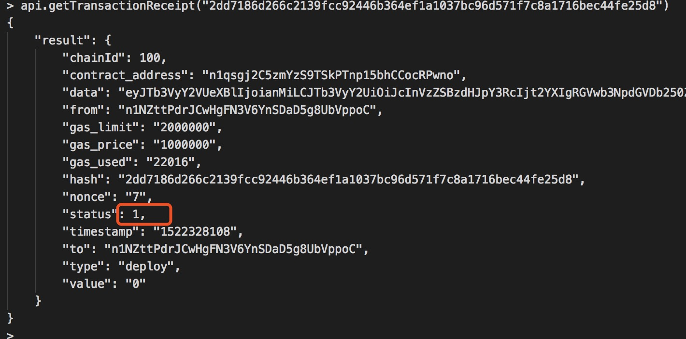
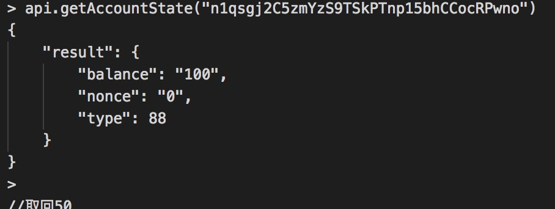
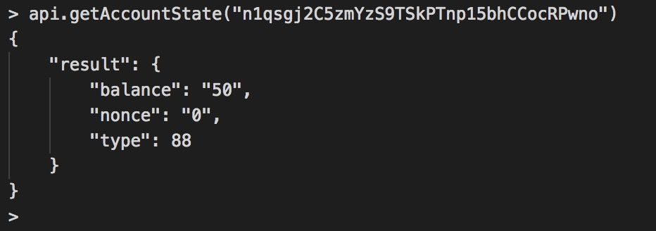

# Nebulas 101 - 03 Write and run a smart contract
[YouTube Tutorial](https://www.youtube.com/watch?v=0ut_RcFyQGM)

Today we learn how to write, deploy, and execute smart contracts in Nebulas.

## Ready to work

Before entering the smart contract, first review the previously learned content:

1. Install, compile and start neb application
2. Create a wallet address, setup coinbase, and start mining
3. Query neb node information, wallet address and balance
4. Send a transaction and verify the transaction was successful

If who have doubts about the above content you should go back to the previous chapters. 
So lets do this. We will learn and use smart contracts through the following steps:

1. Write a smart contract
2. Deploy the smart contract
3. Call the smart contract to verify the contract execution results


## Write a smart contract

Like Ethereum, Nebulas implements NVM virtual machines to run smart contracts and NVM implementations use the JavaScript V8 engine, so for the current development we can write smart contracts using JavaScript and TypeScript.

Write a brief specification of a smart contract:

1. The Smart contract code must be a Prototype object;
2. The Smart contract code must have a init() method, this method will only be executed once;
3. The Smart contract inside the private method is _ at the beginning of the method, the private method can not be a external direct call;

Below we use JavaScript to write the first smart contract: bank safe.
This smart contract needs to fulfill the following functions:

1. The user can save money from this bank safe.
2. Users can withdraw money from this bank safe.
3. Users can check the bank balance in the safe.

Smart contract example:

```js
'use strict';

var DepositeContent = function (text) {
	if (text) {
		var o = JSON.parse(text);
		this.balance = new BigNumber(o.balance);
		this.expiryHeight = new BigNumber(o.expiryHeight);
	} else {
		this.balance = new BigNumber(0);
		this.expiryHeight = new BigNumber(0);
	}
};

DepositeContent.prototype = {
	toString: function () {
		return JSON.stringify(this);
	}
};

var BankVaultContract = function () {
	LocalContractStorage.defineMapProperty(this, "bankVault", {
		parse: function (text) {
			return new DepositeContent(text);
		},
		stringify: function (o) {
			return o.toString();
		}
	});
};

// save value to contract, only after height of block, users can takeout
BankVaultContract.prototype = {
	init: function () {
		//TODO:
	},

	save: function (height) {
		var from = Blockchain.transaction.from;
		var value = Blockchain.transaction.value;
		var bk_height = new BigNumber(Blockchain.block.height);

		var orig_deposit = this.bankVault.get(from);
		if (orig_deposit) {
			value = value.plus(orig_deposit.balance);
		}

		var deposit = new DepositeContent();
		deposit.balance = value;
		deposit.expiryHeight = bk_height.plus(height);

		this.bankVault.put(from, deposit);
	},

	takeout: function (value) {
		var from = Blockchain.transaction.from;
		var bk_height = new BigNumber(Blockchain.block.height);
		var amount = new BigNumber(value);

		var deposit = this.bankVault.get(from);
		if (!deposit) {
			throw new Error("No deposit before.");
		}

		if (bk_height.lt(deposit.expiryHeight)) {
			throw new Error("Can not takeout before expiryHeight.");
		}

		if (amount.gt(deposit.balance)) {
			throw new Error("Insufficient balance.");
		}

		var result = Blockchain.transfer(from, amount);
		if (!result) {
			throw new Error("transfer failed.");
		}
		Event.Trigger("BankVault", {
			Transfer: {
				from: Blockchain.transaction.to,
				to: from,
				value: amount.toString()
			}
		});

		deposit.balance = deposit.balance.sub(amount);
		this.bankVault.put(from, deposit);
	},
	balanceOf: function () {
		var from = Blockchain.transaction.from;
		return this.bankVault.get(from);
	},
	verifyAddress: function (address) {
		// 1-valid, 0-invalid
		var result = Blockchain.verifyAddress(address);
		return {
			valid: result == 0 ? false : true
		};
	}
};
module.exports = BankVaultContract;
```
As you can see from the smart contract example above, `BankVaultContract` is a prototype object that has an init() method that satisfies what we call the most basic specification for writing smart contracts.
BankVaultContract implements two other methods:

- save(): The user can save money to the bank safe by calling the save() method;
- takeout(): Users can withdraw money from bank safe by calling takeout() method;
- balanceOf(): The user can check the balance with the bank vault by calling the balanceOf() method;

The contract code above uses the built-in `Blockchain` object and the built-in` BigNumber() `method. Let's break down the parsing contract code line by line:
save():

```js

// Deposit the amount into the safe

save: function (height) {
	var from = Blockchain.transaction.from;
	var value = Blockchain.transaction.value;
	var bk_height = new BigNumber(Blockchain.block.height);

	var orig_deposit = this.bankVault.get(from);
	if (orig_deposit) {
		value = value.plus(orig_deposit.balance);
	}
	var deposit = new DepositeContent();
	deposit.balance = value;
	deposit.expiryHeight = bk_height.plus(height);

	this.bankVault.put(from, deposit);
},
```

takeout ():

```js
takeout: function (value) {
	var from = Blockchain.transaction.from;
	var bk_height = new BigNumber(Blockchain.block.height);
	var amount = new BigNumber(value);

	var deposit = this.bankVault.get(from);
	if (!deposit) {
		throw new Error("No deposit before.");
	}

	if (bk_height.lt(deposit.expiryHeight)) {
		throw new Error("Can not takeout before expiryHeight.");
	}

	if (amount.gt(deposit.balance)) {
		throw new Error("Insufficient balance.");
	}

	var result = Blockchain.transfer(from, amount);
	if (!result) {
		throw new Error("transfer failed.");
	}
	Event.Trigger("BankVault", {
		Transfer: {
			from: Blockchain.transaction.to,
			to: from,
			value: amount.toString()
		}
	});

	deposit.balance = deposit.balance.sub(amount);
	this.bankVault.put(from, deposit);
},
```

## Deploy smart contracts
Here's how to write a smart contract in Nebulas, and now we need to deploy the smart contract to the chain.
Earlier, I introduced how users made a transfer in Nebulas, and we used the sendTransaction() interface to initiate a transfer. Deploying a smart contract in Nebulas is actually sending a transaction to do so, just by calling the sendTransaction() interface, just with different parameters.

```js
sendTransaction(from, to, value, nonce, gasPrice, gasLimit, contract)
```
We agree that if from and to are the same address, we assume that we are deploying a smart contract.

- value: "0" `when deploying the contract;
- gasPrice: The gasPrice used to deploy the smart contract, which can be obtained via `GetGasPrice`, or using default values: `"1000000"`;
- gasLimit: The gasLimit for the deployment contract, which can be used to get the gas consumption of the deployment contract via [`EstimateGas`](https://github.com/nebulasio/wiki/blob/master/rpc.md#estimateGas), and can not use the default value, Can also set a larger value, the actual use of the calculation.
- contract: the contract information, the parameters passed in when the contract is deployed
- `source`: contract code
- `sourceType`: Contract code type,` js` and `ts` (corresponding to javaScript and typeScript code)
- `args`: contract initialization method parameters, no parameters for the empty string, a parameter for the JSON array

Detailed Interface Documentation [API](https://github.com/nebulasio/wiki/blob/master/rpc_admin.md#sendtransaction).

Example of deploying a smart contract using curl:

```bash

// Request
curl -i -H 'Accept: application/json' -X POST http://localhost:8685/v1/admin/transaction -H 'Content-Type: application/json' -d '{"from":"n1NZttPdrJCwHgFN3V6YnSDaD5g8UbVppoC","to":"n1NZttPdrJCwHgFN3V6YnSDaD5g8UbVppoC", "value":"0","nonce":7,"gasPrice":"1000000","gasLimit":"2000000","contract":{"source":"\"use strict\";var DepositeContent=function(text){if(text){var o=JSON.parse(text);this.balance=new BigNumber(o.balance);this.expiryHeight=new BigNumber(o.expiryHeight);}else{this.balance=new BigNumber(0);this.expiryHeight=new BigNumber(0);}};DepositeContent.prototype={toString:function(){return JSON.stringify(this);}};var BankVaultContract=function(){LocalContractStorage.defineMapProperty(this,\"bankVault\",{parse:function(text){return new DepositeContent(text);},stringify:function(o){return o.toString();}});};BankVaultContract.prototype={init:function(){},save:function(height){var from=Blockchain.transaction.from;var value=Blockchain.transaction.value;var bk_height=new BigNumber(Blockchain.block.height);var orig_deposit=this.bankVault.get(from);if(orig_deposit){value=value.plus(orig_deposit.balance);} var deposit=new DepositeContent();deposit.balance=value;deposit.expiryHeight=bk_height.plus(height);this.bankVault.put(from,deposit);},takeout:function(value){var from=Blockchain.transaction.from;var bk_height=new BigNumber(Blockchain.block.height);var amount=new BigNumber(value);var deposit=this.bankVault.get(from);if(!deposit){throw new Error(\"No deposit before.\");} if(bk_height.lt(deposit.expiryHeight)){throw new Error(\"Can not takeout before expiryHeight.\");} if(amount.gt(deposit.balance)){throw new Error(\"Insufficient balance.\");} var result=Blockchain.transfer(from,amount);if(!result){throw new Error(\"transfer failed.\");} Event.Trigger(\"BankVault\",{Transfer:{from:Blockchain.transaction.to,to:from,value:amount.toString()}});deposit.balance=deposit.balance.sub(amount);this.bankVault.put(from,deposit);},balanceOf:function(){var from=Blockchain.transaction.from;return this.bankVault.get(from);},verifyAddress:function(address){var result=Blockchain.verifyAddress(address);return{valid:result==0?false:true};}};module.exports=BankVaultContract;","sourceType":"js", "args":""}}'

// Result
{
	"result":
	{
		"txhash":"2dd7186d266c2139fcc92446b364ef1a1037bc96d571f7c8a1716bec44fe25d8","contract_address":"n1qsgj2C5zmYzS9TSkPTnp15bhCCocRPwno"
	}
}
```

The return value for deploying a smart contract is the transaction's hash address `txhash` and the contract's deployment address `contract_address`.
Get the return value does not guarantee the successful deployment of the contract, because the sendTransaction () is an asynchronous process, need to be packaged by the miner, just as the previous transfer transaction, the transfer does not arrive in real time, dependent on the speed of the miner packing, so need to wait for a Time (about 1 minute), then you can verify the contract is deployed successfully by querying the contract address or calling a smart contract.

## Verify the deployment of the contract is successful
We got the contract address `contract_address` when deploying the smart contract, and we can easily check the contract's address information using the console to verify whether the contract has been deployed successfully.

As shown above, if we can get the contract information by the address of the contract, it means the contract has been deployed successfully.

## Execute smart contract method
The way to call a smart contract in Nebulas is also straightforward, using the sendTransaction() method to invoke the smart contract directly.

```js
sendTransaction(from, to, value, nonce, gasPrice, gasLimit, contract)
```
- from: user wallet address
- to: smart contract address
- value: The amount of money used to transfer a smart contract
- nonce: from user transaction ID, the order of growth
- gasPrice: The gasPrice used to deploy the smart contract, which can be obtained via `GetGasPrice`, or using default values `"1000000"`;
- gasLimit: The gasLimit for the deployment contract, which can be used to get the gas consumption of the deployment contract via [`EstimateGas`](https://github.com/nebulasio/wiki/blob/master/rpc.md#estimateGas), and can not use the default value, Can also set a larger value, the actual use of the calculation.
- contract: the contract information, the parameters passed in when the contract is deployed
- `function`: Call the contract method
- `args`: contract method parameters, no argument is an empty string, there are parameters for the JSON array

Call smart contract save() method:

```js
// Request
curl -i -H 'Accept: application/json' -X POST http://localhost:8685/v1/admin/transaction -H 'Content-Type: application/json' -d '{"from":"n1NZttPdrJCwHgFN3V6YnSDaD5g8UbVppoC","to":"n1qsgj2C5zmYzS9TSkPTnp15bhCCocRPwno", "value":"100","nonce":8,"gasPrice":"1000000","gasLimit":"2000000","contract":{"function":"save","args":"[0]"}}'

// Result
{
	"result":{"txhash":"b55358c2e12c1d48d4e6beaee7002a59138294fb2896ea8059ff5277553af59f","contract_address":""}
}
```

The essence of the smart contract transfer is also to submit a transaction, it also depends on the miners to pack, the miners will be successful after the transaction package call is considered successful, so the call of the smart contract is not immediately effective. We need to wait for a while (about a minute) and we can verify that our call was successful.
Above we call the save () method to the bank safe deposit amount of 100 funds, you need to deduct 100 from the user's balance, so there is a transfer process, the amount of the transfer need to pass the value field. After the contract is invoked, you only need to verify that the smart contract's address balance is 100.
Console console can easily check the current smart contract address amount:


Call the smart contract takeout() method:

```js
// Request
curl -i -H 'Accept: application/json' -X POST http://localhost:8685/v1/admin/transaction -H 'Content-Type: application/json' -d '{"from":"n1NZttPdrJCwHgFN3V6YnSDaD5g8UbVppoC","to":"n1qsgj2C5zmYzS9TSkPTnp15bhCCocRPwno","value":"0","nonce":9,"gasPrice":"1000000","gasLimit":"2000000","contract":{"function":"takeout","args":"[50]"}}'

// Result
{
	"result":{"txhash":"3d069543cb659c0cc4254b7ff96b2020b5d2d0a54f111cf0f20f177356988dce","contract_address":""}
}
```
The above takeout() method is different from the save() method except that the value of 50 is taken out of the safe, and the amount withdrawn to the user is an operation inside the smart contract, so the value parameter does not need to have a value and the amount withdrawn is the operation Smart contract related parameters, so passed through args parameters.
Then we need to verify that the current smart contract address balance is not 50:


The picture above shows that the smart contract call result is correct, and the smart contract deployment to the call is successful.

## query smart contract data
The smart contracts and execution methods that have been submitted in Nebulas are submitted to the chain. It is also easy to find out how smart contracts have generated data. Smart contracts can be invoked via the rpc interface call() method. Calling a contract method via the `call()` method is not posted to the chain.

```js
call(from, to, value, nonce, gasPrice, gasLimit, contract)
```
- from: user wallet address
- to: user wallet address / smart contract address
- value: The amount of money used to transfer a smart contract
- nonce: user transaction ID, the order of growth
- gasPrice: The gasPrice used to deploy the smart contract, which can be obtained via `GetGasPrice`, or an empty string, using default values;
- gasLimit: The gasLimit for the deployment contract, which can be used to get the gas consumption of the deployment contract via [`EstimateGas`](https://github.com/nebulasio/wiki/blob/master/rpc.md#estimateGas), and can not use the default value, Can also set a larger value, the actual use of the calculation.
- contract: the contract information, the parameters passed in when the contract is deployed
- `source`: contract code
- `sourceType`: Contract code type,` js` and `ts` (corresponding to javaScript and typeScript code)
- `function`: Call the contract method
- `args`: contract initialization method parameters, no parameters for the empty string, a parameter for the JSON array

** Notice: If you want to submit a smart contract, pass in the `source`,` sourceType`, and `args` parameters, if you call the smart contract method, pass` function` and `args`. **

Call the smart contract balanceOf() method:

```js
// Request
curl -i -H 'Accept: application/json' -X POST http://localhost:8685/v1/user/call -H 'Content-Type: application/json' -d '{"from":"n1NZttPdrJCwHgFN3V6YnSDaD5g8UbVppoC","to":"n1qsgj2C5zmYzS9TSkPTnp15bhCCocRPwno","value":"0","nonce":10,"gasPrice":"1000000","gasLimit":"2000000","contract":{"function":"balanceOf","args":""}}'

// Result
{
	"result":{"result":"{\"balance\":\"50\",\"expiryHeight\":\"556\"}","execute_err":"","estimate_gas":"20209"}
}

```
The essence of smart contract query is to submit a transaction, transactions are submitted only in the local implementation or local network, so the smart contract inquiries immediately take effect. With the query method it returns the results and you can see the results.

### Next step: Tutorial 4:

 [Smart Contract Storage](https://github.com/nebulasio/wiki/blob/master/tutorials/%5BEnglish%5D%20Nebulas%20101%20-%2004%20Smart%20Contract%20Storage.md)
 
