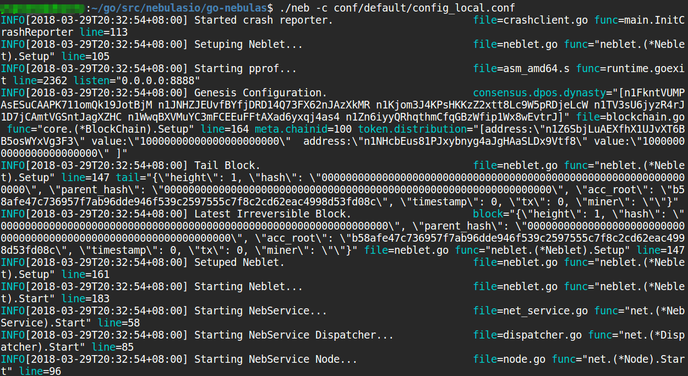
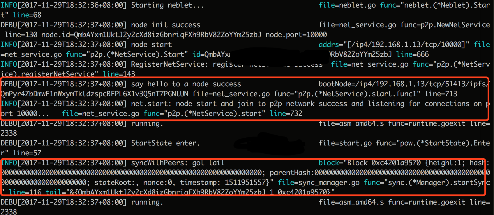



# Nebulas 101 - 01 Compilação e Instalação de Nebulas

[Tutorial YouTube](https://www.youtube.com/watch?v=qtjss2LzSI4&list=PLFipfN18ZQwsW1_dge4w7dfsVNdNZZ37R)

O código fonte do projecto [Nebulas](https://nebulas.io/) foi lançado em várias versões e testado para executar localmente. Pode descarregá-lo e compilar a blockchain privada localmente.

Para aprender sobre Nebulas, por favor leia o [White Paper Não-Técnico de Nebulas](https://nebulas.io/docs/NebulasWhitepaper.pdf).

Para aprender sobre a técnologia, por favor leia o [White Paper Técnico](https://nebulas.io/docs/NebulasTechnicalWhitepaper.pdf) e [código no github](https://github.com/nebulasio/go-nebulas) de Nebulas.


> Nebulas apenas pode correr em Mac e Linux, de momento. A versão Windows irá ser lançada brevemente.

## Ambiente de desenvolvimento para Golang

Para já, Nebulas está implementado em Golang.

| Componentes | Versão | Descrição |
|----------|-------------|-------------|
|[Golang](https://golang.org) | >= 1.9.2| A Linguagem De Programação Go |

### Mac OSX

[Homebrew](https://brew.sh/) é recomendado para instalar Golang em Mac.

```bash
# install
brew install go

# environment variables
export GOPATH=/caminho/para/areadetrabalho
```

> Nota: GOPATH é o directório de trabalho que pode ser escolhido por si. Depois de configurar o GOPATH, os seus projectos Go terão de ser colocados no directório GOPATH.

### Linux

```bash
# download
wget https://dl.google.com/go/go1.9.3.linux-amd64.tar.gz

# extração
tar -C /usr/local -xzf go1.9.3.linux-amd64.tar.gz

# variáveis do ambiente de trabalho
export PATH=$PATH:/usr/local/go/bin
export GOPATH=/caminho/para/areadetrabalho
```

## Compilação Nebulas

### Download

Clone o código fonte com os seguintes comandos:

```bash
# entra na área de trabalho
mkdir -p $GOPATH/src/github.com/nebulasio
cd $GOPATH/src/github.com/nebulasio

# descarrega
git clone https://github.com/nebulasio/go-nebulas.git

# entra no repositório
cd go-nebulas

# o branch/ramo principal é o mais estável
git checkout master
```

### Instalação RocksDB

* **OS X**:
* Instale rocksdb via [Homebrew](https://brew.sh/)
```bash
brew install rocksdb
```

* **Linux - Ubuntu**
* Instalação Dependências
```bash
apt-get update
apt-get -y install build-essential libgflags-dev libsnappy-dev zlib1g-dev libbz2-dev liblz4-dev libzstd-dev
```
* Instalação rocksdb através do código fonte:
```bash
git clone https://github.com/facebook/rocksdb.git
cd rocksdb && make shared_lib && make install-shared
```

* **Linux - Centos**
* Instale Dependências
```bash
yum -y install epel-release && yum -y update
yum -y install gflags-devel snappy-devel zlib-devel bzip2-devel gcc-c++  libstdc++-devel
```
* Instalação rocksdb através do código fonte:
```bash
git clone https://github.com/facebook/rocksdb.git
cd rocksdb && make shared_lib && make install-shared
```

### Instalação Dependências Go

As dependências do Go em Go-Nebulas são geridas por [Dep](https://github.com/golang/dep).

| Componentes | Versão | Descrição |
|----------|-------------|-------------|
[Dep](https://github.com/golang/dep) | >= 0.3.1 | Dep é uma ferramenta para a gerência de dependências para Go. |

#### Instalação Dep

* **Mac OSX**
* Instalação Dep via [Homebrew](https://brew.sh/)
```bash
brew install dep
brew upgrade dep
```

* **Linux**
* Instalação Dep
```bash
cd /usr/local/bin/
wget https://github.com/golang/dep/releases/download/v0.3.2/dep-linux-amd64
ln -s dep-linux-amd64 dep
```

#### Descarrega Dependências

Muda para o directório raíz do projecto para descarregar as dependências para Go-Nebulas:

```bash
cd $GOPATH/src/github.com/nebulasio/go-nebulas
make dep
```

> `make dep` descarrega imensas dependências. Pode demorar muito tempo para as descarregar a primeira vez. A descarga de algumas dependências pode falhar. Se não consegui descarregá-las, pode fazer a descarga directa do ficheiro zipado das dependências geradas pelo Dep [vendor.tar.gz](https://s3-us-west-1.amazonaws.com/develop-center/setup/vendor.tar.gz) e extraí-lo no directório raiz de Nebulas.
> ```bash
> vendor.tar.gz
> MD5: a8ff50c9c01c67e37300a062edf7949d
> ```

A Nebulas NVM (Máquina Virtual Nebulas) depende do interpretador V8 de JavaScript. Compilamos as dependências V8 para Mac/Linux. Corra os seguintes comandos para as instalar.

```bash
cd $GOPATH/src/github.com/nebulasio/go-nebulas
make deploy-v8
```

### Construa Neb

Agora pode criar o executável para Nebulas, já que as dependências do V8 e do golang foram satisfeitas.

Compile no directório raiz do projecto:

```bash
cd $GOPATH/src/github.com/nebulasio/go-nebulas
make build
```

Uma vez que a compilação tiver acabado irá encontrar um ficheiro `neb` executável no directório raiz.


## Comece NEB

### Bloco Génese

Antes de lançar uma nova chain Nebulas, temos de definir a configuração do bloco génese. 

#### Configuração do Bloco Génese

```protobuf
# Ficheiro de texto Neb génese. Esquema é definido em core/pb/genesis.proto.

meta {
# Identidade da chain
chain_id: 100
}

consensus {
dpos {
# Dinastia inicial, incluíndo todos os mineradores iniciais
dynasty: [
[ miner address ],
...
]
}
}

# Pré-atribuição dos tokens iniciais
token_distribution [
{
address: [ endereço de atribuição ]
value: [ quantidade de atribuição de tokens ]
},
...
]
```

Um exemplo de uma genesis.conf encontra-se em `conf/default/genesis.conf`.

### Configuração

Antes de activar o nó neb, temos de definir a configuração do mesmo.

#### Configuração do Nó Neb

```protobuf
# Ficheiro de configuração Neb. Esquema é definido em neblet/pb/config.proto:Config.

# Configuração da rede
network {
# Para o primeiro nó numa novo chain Nebulas, não é preciso uma `seed` (semente).
# Caso contrário, todo o nó precisa de nós semente para serem introduzidos na chain de Nebulas.
# semente: ["/ip4/127.0.0.1/tcp/8680/ipfs/QmP7HDFcYmJL12Ez4ZNVCKjKedfE7f48f1LAkUc3Whz4jP"]

# Host de serviço de rede P2p. Suporta múltiplos Ips e portas.
listen: ["0.0.0.0:8680"]

# A chave privada é usada para gerar o ID do nó. Se não usar chave privada, o nó vai gerar um novo ID de nó.
# private_key: "conf/network/id_ed25519"
}

# Configuração da Chain
chain {
# ID da Chain de Rede
chain_id: 100

# Local de armazenamento da base de dados
datadir: "data.db"

# Local da keystore das contas
keydir: "keydir"

# Configuração do bloco de génese
genesis: "conf/default/genesis.conf"

# Algoritmo da assinatura
signature_ciphers: ["ECC_SECP256K1"]

# Endereço do minerador
miner: "n1SAQy3ix1pZj8MPzNeVqpAmu1nCVqb5w8c"

# Endereço Coinbase, todas as recompensas recebidas pelo minerador acima serão enviadas para este endereço
coinbase: "n1FF1nz6tarkDVwWQkMnnwFPuPKUaQTdptE"

# A palavra passe para o ficheiro da keystore do minerador
passphrase: "passphrase"
}

# Configuração do API
rpc {
# Porta do API GRPC
rpc_listen: ["127.0.0.1:8684"]

# Porta do API HTTP
http_listen: ["127.0.0.1:8685"]

# O módulo aberto
http_module: ["api", "admin"]
}

# Configuração do registo
app {
# Nível de registo: [debug, info, warn, error, fatal]
log_level: "info"

# Local do registo
log_file: "logs"

# Abrir registo de falhas
enable_crash_report: false
}

# Configuração de métricas
stats {
# Abrir nó de métricas
enable_metrics: false

# Configuração influxdb
influxdb: {
host: "http://localhost:8086"
db: "nebulas"
user: "admin"
password: "admin"
}
}

```

Muitos exemplos podem ser encontrados em `$GOPATH/src/github.com/nebulasio/go-nebulas/conf/`

## Operar nós

> A chain Nebulas que está a operar de momento é privada e diferente da Testnet e Mainnet oficial.

Activa o teu primeiro nó Nebulas com os seguintes comandos:

```bash
cd $GOPATH/src/github.com/nebulasio/go-nebulas
./neb -c conf/default/config.conf
```

Depois de iniciar, o seguinte deverá aparecer no terminal:


Por padrão, o nó que usa `conf/default/config.conf` não irá minerar novos blocos.
Activa o teu primeiro nó de mineração Nebulas com os próximos comandos:

```bash
cd $GOPATH/src/github.com/nebulasio/go-nebulas
./neb -c conf/example/miner.conf
```

Depois do nó iniciar, se a conexão com o nó semente suceder, irá ver o seguinte registo, que estará no ficheiro de registo `logs/miner/neb.log`:


> Nota: Pode iniciar vários nós localmente. Por favor confirme que as portas nos ficheiros de configuração dos nós são diferentes para não haverem conflictos.

### Próximo passo: Tutorial 2

[Envio de Transações com Nebulas](https://github.com/nebulasio/wiki/blob/master/tutorials/%5BPortugues%5D%20Nebulas%20101%20-%2002%20Transacao.md)
