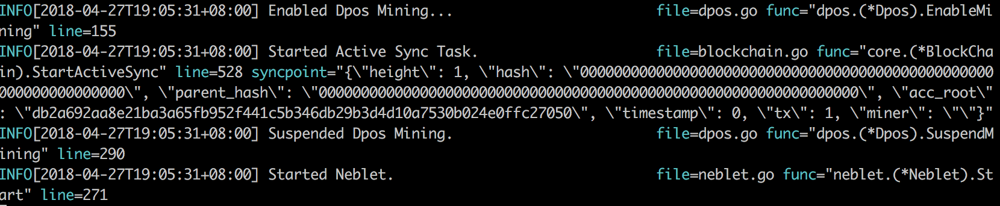
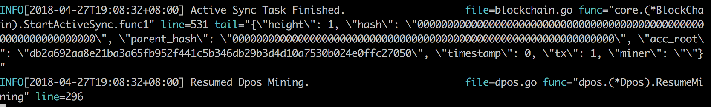
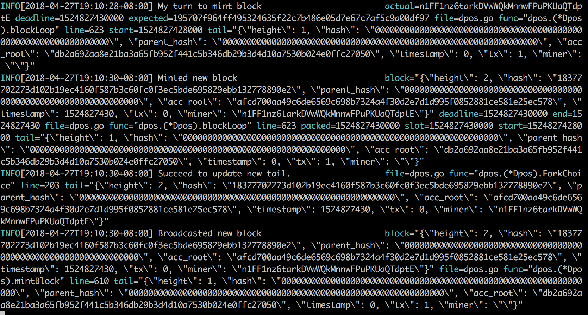

# Nebulas 101 - 01 编译安装星云链

[星云链](https://nebulas.io/)的项目代码已经发布了几个版本，经过测试可以在本地运行，大家可以下载星云链源代码在本地编译私有链。

想了解星云链的同学可以阅读星云链[非技术白皮书](https://nebulas.io/docs/NebulasWhitepaperZh.pdf)。

对技术感兴趣的同学可以看星云链[技术白皮书](https://nebulas.io/docs/NebulasTechnicalWhitepaperZh.pdf)和星云链[Github代码](https://github.com/nebulasio/go-nebulas)。

> 星云链现阶段只能在Mac和Linux上运行，后续会推出windows版本。

## Golang环境搭建

| Components | Version | Description |
|----------|-------------|-------------|
|[Golang](https://golang.org) | >= 1.9.2| The Go Programming Language |

我们会分别介绍Mac OSX和Linux两种系统下golang环境的搭建。

### Mac OSX

在Mac OSX里，我们推荐使用[`Homebrew`](https://brew.sh/)来安装Golang.

```bash
# 安装
brew install go

# 配置环境变量
export GOPATH=/path/to/workspace
```

> 提示: 在golang的开发中，GOPATH是必须的，它指定了我们使用golang开发的工作空间。所有的源码都应放在GOPATH之下。

### Linux

```bash
# download
wget https://dl.google.com/go/go1.9.3.linux-amd64.tar.gz

# extract
tar -C /usr/local -xzf go1.9.3.linux-amd64.tar.gz

# environment variables
export PATH=$PATH:/usr/local/go/bin
export GOPATH=/path/to/workspace
```

## 编译星云链

### 下载源码

可以使用如下指令直接下载最新版本的星云链源码。

```bash
# 进入工作目录
mkdir -p $GOPATH/src/github.com/nebulasio
cd $GOPATH/src/github.com/nebulasio

# 下载源码
git clone https://github.com/nebulasio/go-nebulas.git

# 进入项目目录
cd go-nebulas

# 切换到最稳定的master分支
git checkout master
```

### 安装rocksdb依赖库

同样我们会介绍如何在MAC OSX和Linux正确安装RocksDB。

#### Mac OSX

可以直接通过[Homebrew](https://brew.sh/)安装，运行`brew install rocksdb`

#### Linux

在linux环境下，由于ubuntu和centos系统的用户偏多，我们将分别介绍这两个主流环境下RocksDB的安装。

##### Ubuntu

* 首先安装RocksDB所需依赖库
    ```bash
    apt-get update
    apt-get -y install build-essential libgflags-dev libsnappy-dev zlib1g-dev libbz2-dev liblz4-dev libzstd-dev
    ```
* 下载源码并编译安装
    ```bash
    git clone https://github.com/facebook/rocksdb.git
    cd rocksdb && make shared_lib && make install-shared
    ```

##### Centos

* 首先安装RocksDB所需依赖库
    ```bash
    yum -y install epel-release && yum -y update
    yum -y install gflags-devel snappy-devel zlib-devel bzip2-devel gcc-c++  libstdc++-devel
    ```
* 下载源码并编译安装
    ```bash
    git clone https://github.com/facebook/rocksdb.git
    cd rocksdb && make shared_lib && make install-shared
    ```

### 安装Go依赖库

在Go-Nebulas中，Go的三方库都通过[Dep](https://github.com/golang/dep)来做管理。

| Components | Version | Description |
|----------|-------------|-------------|
[Dep](https://github.com/golang/dep) | >= 0.3.1 | Dep is a dependency management tool for Go. |

#### 安装Dep工具

我们同样分别介绍Mac OSX和Linux下Dep的安装方法。

##### Mac OSX

* 通过[Homebrew](https://brew.sh/)直接安装并升级Dep
    ```bash
    brew install dep
    brew upgrade dep
    ```

##### Linux

* 通过源码来安装Dep
    ```bash
    cd /usr/local/bin/
    wget https://github.com/golang/dep/releases/download/v0.3.2/dep-linux-amd64
    ln -s dep-linux-amd64 dep
    ```

#### 下载Go三方库

我们切换到Go-Nebulas项目根目录，然后使用Dep来下载三方库。

```bash
cd $GOPATH/src/github.com/nebulasio/go-nebulas
make dep
```

> 提示: `make dep`将会下载很多依赖库。在部分地区，这个过程可能比较耗时。所以，我们提供了依赖库的压缩包[vendor.tar.gz](http://ory7cn4fx.bkt.clouddn.com/vendor.tar.gz)。可以使用下列指令通过压缩包来安装GO依赖库。
> ```bash
> wget http://ory7cn4fx.bkt.clouddn.com/vendor.tar.gz
> cd $GOPATH/src/github.com/nebulasio/go-nebulas
> tar zxf vendor.tar.gz
> ```

### 安装Chrome V8依赖库

星云虚拟机目前依赖于Chrome的V8引擎，为了大家使用方便，我们已经为Mac OSX和Linux编译好了V8的动态库。运行如下指令就可以完成安装。

```bash
cd $GOPATH/src/github.com/nebulasio/go-nebulas
make deploy-v8
```

### 编译可执行文件

完成所有上述依赖库的安装后，现在我们可以进入Go-Nebulas根目录编译星云链的可执行文件了。

```bash
cd $GOPATH/src/github.com/nebulasio/go-nebulas
make build
```

编译成功后，将会看到如下信息。


## 运行星云链

### 创世区块

在启动一个新的星云链前，我们必须定义创世区块的配置文件。

#### 创世区块配置

```protobuf
meta {
  # 每条链的唯一标识
  # 每个区块和交易只会属于一条唯一的链，保证安全性
  chain_id: 100
}

consensus {
  # 在贡献度证明(PoD)被充分验证前，星云链采用DPoS共识算法
  # DPoS共识中，21个人组成一个朝代
  # 每隔一段时间都会切换朝代，每个朝代内，21个矿工轮流出块
  # 由于DPoS只是过渡方案，所以暂时不开放给公众挖矿，即当前版本朝代不会发生变更
  dpos {
    # 初始朝代，包含21个初始矿工地址
    dynasty: [
      [ miner address ],
      ...
    ]
  }
}

# 预分配的代币
token_distribution [
  {
    address: [ allocation address ]
    value: [ amount of allocation tokens ]
  },
  ...
]
```

可以在根目录`conf/default/genesis.conf`下，找到一个完整的创世区块配置实例。

### 配置文件

在我们启动一个星云节点前，我们需要定义好该节点的配置文件。

#### 星云节点配置文件

```protobuf
# 网络配置
network {
  # 对于全网第一个节点，不需要配置seed
  # 否则，其他节点启动时需要配置seed，seed节点将会把网络中其他节点的路由信息同步给刚启动的节点
  # 可以配置多个seed, ["...", "..."]
  seed: ["/ip4/127.0.0.1/tcp/8680/ipfs/QmP7HDFcYmJL12Ez4ZNVCKjKedfE7f48f1LAkUc3Whz4jP"]

  # 节点监听网络消息端口，可以配置多个
  listen: ["0.0.0.0:8680"]

  # 网络私钥，用于确认身份节点
  # private_key: "conf/network/id_ed25519"
}

# 链配置
chain {
  # 链的唯一标识
  chain_id: 100

  # 数据存储地址
  datadir: "data.db"

  # 账户keystore文件存储地址
  keydir: "keydir"

  # 创世区块配置
  genesis: "conf/default/genesis.conf"

  # 签名算法，请勿修改
  signature_ciphers: ["ECC_SECP256K1"]

  # 矿工地址，矿工的keystore文件需要放置在配置的keydir下
  miner: "n1XkoVVjswb5Gek3rRufqjKNpwrDdsnQ7Hq"

  # Coinbase地址，该地址用于接收矿工的挖矿奖励，可以和矿工地址一致
  # 该地址的keystore无需暴露，不用放置在配置的keydir下
  coinbase: "n1FF1nz6tarkDVwWQkMnnwFPuPKUaQTdptE"

  # 矿工地址的密码
  passphrase: "passphrase"
}

# API配置
rpc {
    # GRPC服务端口
    rpc_listen: ["127.0.0.1:8684"]

    # HTTP服务端口
    http_listen: ["127.0.0.1:8685"]

    # 开放的API模块
    # API模块包含所有和用户私钥无关的接口
    # Admin模块包含所有和用户私钥相关的接口，需要慎重考虑该模块的访问权限
    http_module: ["api", "admin"]
}

# 日志配置
app {
    # 日志级别: 支持[debug, info, warn, error, fatal]
    log_level: "info"

    # 日志存放位置
    log_file: "logs"

    # 是否打开crash report服务
    enable_crash_report: false
}

# 监控服务配置
stats {
    # 是否打开监控服务
    enable_metrics: false

    # 监控服务将数据上传到Influxdb
    # 配置Influxdb的访问信息
    influxdb: {
        host: "http://localhost:8086"
        db: "nebulas"
        user: "admin"
        password: "admin"
    }
}

```

A lot of examples can be found in `$GOPATH/src/github.com/nebulasio/go-nebulas/conf/`

### 启动星云链

> 此时启动的星云链是本地的私有链，和官方的测试网和主网没有任何相互关联

启动你的第一个星云节点。

```bash
cd $GOPATH/src/github.com/nebulasio/go-nebulas
./neb -c conf/default/config.conf
```

启动成功的话，将会看到如下信息，有`Started Neblet`的日志输出。


默认情况下，使用配置文件`conf/default/config.conf`启动的节点不是矿工节点。

接下来，启动你的第一个矿工节点，它的seed节点即我们刚刚启动的第一个节点。

```bash
cd $GOPATH/src/github.com/nebulasio/go-nebulas
./neb -c conf/example/miner.conf
```

在这个节点启动后，你会先看到如下信息，表示当前节点正在找种子节点同步。



等待一会儿，将会看到如下信息，表示当前节点已经连上了seed节点完成了同步。



再等待几分钟，你会看到如下信息，表示当前矿工节点挖出了第一个区块。



> 提示: 目前的DPoS共识算法，会有21个节点轮流出块。由于我们只启动了21个矿工节点中的一个矿工节点，所以每隔15*21s才出一个块。你可以启动更多的矿工节点，填补的空缺。但是需要注意，多个节点间的端口号不要相互冲突了。

### 下一章

[在星云链上发送交易](https://github.com/nebulasio/wiki/blob/master/tutorials/%5B中文%5D%20Nebulas%20101%20-%2002%20发送交易.md)

