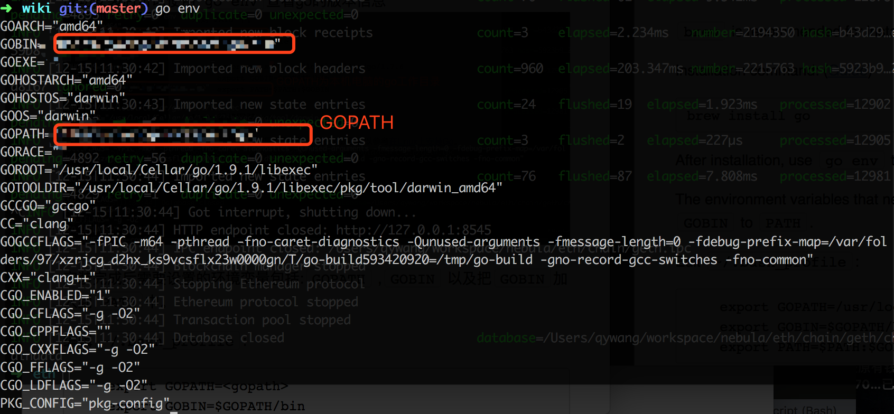

# Nebulas 101 - 01 编译安装星云链

[星云链](https://nebulas.io/)的项目代码已经发布了几个版本，经过测试可以在本地运行，大家可以下载星云链源代码在本地编译私有链。

想了解星云链的同学可以阅读星云链[非技术白皮书](https://nebulas.io/docs/NebulasWhitepaperZh.pdf)。

对技术感兴趣的同学可以看星云链[技术白皮书](https://nebulas.io/docs/NebulasTechnicalWhitepaperZh.pdf)和星云链[github代码](https://github.com/nebulasio/go-nebulas)。

## 星云链环境搭建
星云链使用go语言开发，首先需要安装go语言的开发环境。推荐使用Mac搭建星云链环境。星云链对go版本的要求`>=1.8`。

*由于星云链的NVM(星云链虚拟机)使用了JavaScript的v8引擎，目前官方代码提供的v8依赖库只有Mac和Linux版本；星云链现阶段只能在Mac和Linux上运行，后续会推出windows版本。*

[官方go安装文档](https://golang.org/doc/install)

#### Mac系统安装go环境
Mac系统下安装go环境推荐使用`brew`安装。系统未安装`brew`的请参考[homebrew官网](https://brew.sh/)。

安装命令：([参考教程](http://www.jianshu.com/p/358cbc939569))

```
brew install go
```

成功安装后可以使用`go env`查看go的版本信息


安装完成后需要设置的环境变量包括:`GOPATH ` ,`GOBIN ` 以及把`GOBIN`加入到`PATH`中。

编辑`~/.bash_profile`:

```
    export GOPATH=<gopath>
    export GOBIN=$GOPATH/bin
    export PATH=$PATH:$GOBIN
```
**注意：GOPATH是本地的go工作目录，可以自行配置，在GOPATH配置完后，go项目工程需要放置到GOPATH目录中。**

#### Linux系统安装go：
Linux安装建议使用源代码安装go，安装教程可以参考[在Linux上安装Go](https://github.com/Unknwon/the-way-to-go_ZH_CN/blob/master/eBook/02.3.md)。

## 星云链编译

#### 源代码下载：
首先从github网站conle代码到本地(本教程使用[v0.5.0版本](https://github.com/nebulasio/go-nebulas/tree/v0.5.0))

```
git clone -b v0.5.0 https://github.com/nebulasio/go-nebulas.git --depth=1
```
如果需要完整代码的提交历史，可以全部clone到本地：

```
git clone https://github.com/nebulasio/go-nebulas.git
git checkout master
```
由于go代码编译必须在`$GOPATH`中, 星云链代码要放到go的`$GOPATH`中`/src/github.com/nebulasio/go-nebulas`的位置。请使用`master`分支来运行星云节点。

#### 安装go依赖库
Nebulas的go代码库依赖管理使用[dep](https://github.com/golang/dep)，开发中使用的第三方包可以使用dep下载。

使用`brew`安装`dep`:

```
$ brew install dep
$ brew upgrade dep
```
切换至项目根目录安装go的依赖库：

```
cd <path>/go-nebulas
make dep
```
**PS：make dep需要下载的依赖较多，初次下载较慢，部分依赖库国内网络下载可能失败。若无法下载，可以直接将dep后生成的文件[vendor.tar.gz](http://ory7cn4fx.bkt.clouddn.com/vendor.tar.gz)下载后解压到代码根目录中。**

```
vendor.tar.gz
SHA1: 250eccb8f0a48277765c6266bed55187b6c77b2b
MD5: 13ef26ab05aad391f540f82af07716df
```
#### 安装v8
Nebulas的NVM(星云链虚拟机)使用了JavaScript的v8引擎，需要安装为NVM编译的v8依赖库后`neb`才能运行。v8依赖库星云链官方目前提供了Mac版本的动态链接库`libnebulasv8.dylib`和Linux版本的静态链接库`libnebulasv8.so`及其他so库。项目中已经添加了make命令安装v8依赖库，在项目根目录执行安装指令：

```
make deploy-v8
```
如果不使用make集成v8链接库，也可以单独安装：

* Mac系统
	* `install nf/nvm/native-lib/libnebulasv8.dylib /usr/local/lib/`
* Linux系统
	* `sudo install nf/nvm/native-lib/*.so /usr/local/lib/`
	* `sudo /sbin/ldconfig`
	
#### 编译可执行文件
完成go依赖库和v8依赖包后，可以编译星云链的可执行文件。Nebulas的go工程main函数在`cmd/neb/main.go`中，执行make命令进行编译：

```
make build
```
编译成功后，在根目录生成`neb`可执行文件。


## 搭建本地测试环境

#### 创世区块配置
星云链启动时要配置创世区块的信息，在第一次启动时会使用创世区块配置初始化区块信息。目前星云链暂时使用dpos作为共识算法，初始挖矿成员和NAS的预分配可以在创世区块配置中设置。

配置信息：

```
# Neb genesis text file. Scheme is defined in core/pb/genesis.proto.
#

meta {
  # 星云链ID，私有网络默认为100，测试网络为1001
  chain_id: 100
}

consensus {
  # dpos 初始挖矿成员配置
  dpos {
    dynasty: [
    "1a263547d167c74cf4b8f9166cfa244de0481c514a45aa2c",
    "2fe3f9f51f9a05dd5f7c5329127f7c917917149b4e16b0b8",
    "333cb3ed8c417971845382ede3cf67a0a96270c05fe2f700",
    "48f981ed38910f1232c1bab124f650c482a57271632db9e3",
    "59fc526072b09af8a8ca9732dae17132c4e9127e43cf2232",
    "75e4e5a71d647298b88928d8cb5da43d90ab1a6c52d0905f",
    "7da9dabedb4c6e121146fb4250a9883d6180570e63d6b080",
    "98a3eed687640b75ec55bf5c9e284371bdcaeab943524d51",
    "a8f1f53952c535c6600c77cf92b65e0c9b64496a8a328569",
    "b040353ec0f2c113d5639444f7253681aecda1f8b91f179f",
    "b414432e15f21237013017fa6ee90fc99433dec82c1c8370",
    "b49f30d0e5c9c88cade54cd1adecf6bc2c7e0e5af646d903",
    "b7d83b44a3719720ec54cdb9f54c0202de68f1ebcb927b4f",
    "ba56cc452e450551b7b9cffe25084a069e8c1e94412aad22",
    "c5bcfcb3fa8250be4f2bf2b1e70e1da500c668377ba8cd4a",
    "c79d9667c71bb09d6ca7c3ed12bfe5e7be24e2ffe13a833d",
    "d1abde197e97398864ba74511f02832726edad596775420a",
    "d86f99d97a394fa7a623fdf84fdc7446b99c3cb335fca4bf",
    "e0f78b011e639ce6d8b76f97712118f3fe4a12dd954eba49",
    "f38db3b6c801dddd624d6ddc2088aa64b5a24936619e4848",
    "fc751b484bd5296f8d267a8537d33f25a848f7f7af8cfcf6"
    ]
  }
}

# NAS预分配地址金额，
token_distribution [
  {
    address: "1a263547d167c74cf4b8f9166cfa244de0481c514a45aa2c"
    value: "10000000000000000000000"
  },
  {
    address: "2fe3f9f51f9a05dd5f7c5329127f7c917917149b4e16b0b8"
    value: "10000000000000000000000"
  }
]
```
创世区块配置默认放在`conf/default/genesis.conf`中，配置创世区块路径在下面的配置中可以设置。

#### 节点
星云链节点可以通过执行编译后的`neb`可执行文件启动。节点启动需在终端执行，Neb节点包括种子节点和节点：

* 种子节点：星云链网络种子节点，为其他节点提供初始同步服务；
* 节点：星云链网络普通节点，启动后会先从种子节点同步路由和区块信息。

星云链的种子节点和节点启动通过配置文件来区分。节点启动需要先启动种子节点，在种子节点启动后，将种子节点的网络地址信息更新到普通节点的配置文件中，可以组网挖矿。

#### 启动种子节点
星云链的节点启动需要配置文件提供部分配置参数。配置文件使用了使用[Protocol Buffer](https://github.com/google/protobuf)的格式读取配置信息。工程根目录下有默认种子节点配置文件：

`conf/default/config.conf`

种子节点配置文件内容如下：

```
# 节点网络配置，种子节点和节点的配置在此区分
network {
  # 若为种子节点，不需要配置seed，普通节点需要配置种子节点seed信息
  # seed: "UNCOMMENT_AND_SET_SEED_NODE_ADDRESS"
  # p2p网络服务ip和端口，服务启动的时候可以listen多组不同的ip和端口
  listen: ["127.0.0.1:8680"]
  # 生成节点ID时候用到的私钥路径，如果不配置，每次都会生成新的不同的节点ID；配置了，会使用配置的私钥生成节点ID
  #private_key: "conf/network/id_ed25519"
  # 网络分组ID，不同网络分组ID的节点不能互相通讯
  network_id: 1
}

# blockchain相关配置
chain {
  # 网络中的chainID,测试网络为1001，此处ID需要与创世区块配置中的ID一致
  chain_id: 100
  # 数据库存放的位置
  datadir: "data.db"
  # 节点私钥保存位置
  keydir: "keydir"
  # genesis创世区块的默认配置
  genesis: "conf/default/genesis.conf"
  # 矿机的挖矿地址，获取的奖励将发放给coinbase
  coinbase: "eb31ad2d8a89a0ca6935c308d5425730430bc2d63f2573b8"
  # 节点签名算法
  signature_ciphers: ["ECC_SECP256K1"]
  # 节点挖矿的地址，key文件需要放在`keydir`中
  miner: "eb31ad2d8a89a0ca6935c308d5425730430bc2d63f2573b8"
  # 用于解锁挖矿账户的passphrase
  passphrase: "passphrase"
}

# 用户与节点交互的服务配置
rpc {
    # gRPC API服务端口
    rpc_listen: ["127.0.0.1:8684"]
    # HTTP API服务端口
    http_listen: ["127.0.0.1:8685"]
    # 开放可对外提供http服务的模块
    http_module: ["api","admin"]
}

# app日志相关配置
app {
    # 配置记录的log级别{debug, info, warn, error, fatal}
    log_level: "info"
    # 配置log的输出文件夹
    log_file: "logs"
    # 配置是否输出crash日志
    enable_crash_report: false
}

# 其他配置信息
stats {
    # 是否开启节点监控数据统计
    enable_metrics: false
    # 节点监控数据统计用到的inluxdb的配置
    influxdb: {
        host: "http://localhost:8086"
        db: "nebulas"
        user: "admin"
        password: "admin"
    }
}

```

在不指定配置文件时默认读取工程根目录下的`conf/default/config.conf`启动种子节点。默认启动种子节点命令:

```
./neb
```
若需要使用不同的配置文件，仅需在启动时添加`-c`标记，指定配置文件。例如启动种子节点时指定节点配置文件：

```
./neb -c <path>/config.conf
```
在完成配置文件修改后可以启动节点。启动后可以在终端上看到类似如下信息：


#### 启动节点
在种子节点启动后如果需要启动普通节点组网与种子节点连接，需要在普通节点配置文件中配置种子节点地址信息，种子节点地址可以从种子节点启动log:**node start**中获取：

```
INFO[2017-12-25T15:04:52+08:00] node start                                    addrs="[/ip4/127.0.0.1/tcp/8680]" file=net_service.go func="p2p.(*NetService).Start" id=QmPyr4ZbDmwF1nWxymTktdzspcBFPL6X1v3Q5nT7PGNtUN line=693
```
上面的log中，地址信息为`/ip4/127.0.0.1/tcp/8680`,id为`QmPyr4ZbDmwF1nWxymTktdzspcBFPL6X1v3Q5nT7PGNtUN `，星云链p2p网络使用了ipfs的libp2p网络库，所以种子地址的格式为下述所示:

```
<address>/ipfs/<id>
```
在普通节点配置文件`config.1a2635.conf`中配置如下：

```
network {
  # seed: "UNCOMMENT_AND_SET_SEED_NODE_ADDRESS"
  seed: ["/ip4/127.0.0.1/tcp/8680/ipfs/QmPyr4ZbDmwF1nWxymTktdzspcBFPL6X1v3Q5nT7PGNtUN"]
  listen: ["127.0.0.1:10001"]
  network_id: 1
}
...
```
**Note:若在同一台机器上配置多个节点，注意避免端口占用。**

启动普通子节点时，使用此配置文件启动节点：

```
./neb -c conf/example/config.1a2635.conf
```
节点启动后，如果与种子节点连接成功，可以看到下面的log：
