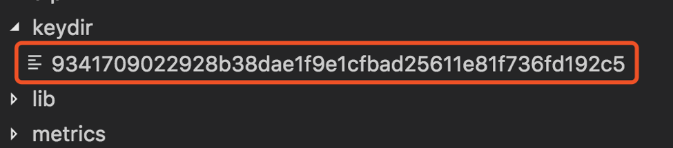

# Nebulas 101 - 02 在星云链上发送交易

Nebulas提供了三种方式去发送我们的交易：

1. 通过http接口
2. 通过console控制台
3. 通过nebulas测试框架

下面我们分别介绍如何通过以上三种方式在nebulas中发送一笔交易，并验证交易是否成功。

### 准备工作
在启动neb应用之前，需要先做一些准备工作：
1. 创建两个钱包地址，一个钱包地址用于挖矿钱包地址coinbase，接收挖矿奖励，也是后文转账交易的发送方，另一个钱包地址是转账的接收地址，即后文转帐交易的接收方。
2.修改节点的配置文件，配置coinbase地址。

1. 创建挖矿钱包地址coinbase
coinbase 对应着矿工挖矿的奖励地址，矿工挖矿得到的奖励都会进到这个地址。所以在启动节点之前，需要先配置coinbase地址。我们用如下的方式来生成一个新的钱包地址，然后设置为coinbase地址，在终端（Terminal）中执行如下命令：
```sh
$ ./neb account new
Your new account is locked with a passphrase. Please give a passphrase. Do not forget this passphrase.
Passphrase:
Repeat passphrase:
Address: 9341709022928b38dae1f9e1cfbad25611e81f736fd192c5
```
Passphrase提示：创建coinbase地址的过程中需要输入一个密码，请牢记这个密码，该密码会用来解锁我们的账户并完成转帐交易等后续操作。
执行完这个命令以后，neb程序会在当前目录的`keydir`子目录下生成该地址对应的Key文件，如图所示：


2. 创建转账的接收地址
现在我们通过同样的方式创建一个转帐交易接收地址。
```sh
$ ./neb account new
Your new account is locked with a passphrase. Please give a passphrase. Do not forget this passphrase.
Passphrase:
Repeat passphrase:
Address: e6dea0d0769fbf71ab01f8e0d78cd59e78361a450e1f4f88
```
执行完这个命令以后，neb程序会在当前目录的`keydir`子目录下新生成该地址对应的Key文件，如图所示：


3. 配置coinbase
需要把新产生的coinbase地址`9341709022928b38dae1f9e1cfbad25611e81f736fd192c5`替换掉配置文件`config-seed.pb.txt`里面的`pow`属性里面的coinbase（如下图所示）。后面用户启动neb应用后挖矿产生的奖励就会进入这个地址。


### 启动neb应用
完成所有的准备工作后，就可以启动neb应用。启动neb应用的方式非常简单：
```
$ ./neb -c config-seed.pb.txt
```
neb应用会加载我们先前设置的`config-seed.pb.txt`配置文件。neb应用启动之后会默认进入挖矿状态，一段时间以后（1~2分钟），挖矿产生的奖励会在我们刚刚设置的coinbase账户地址上面。当前开发代码的挖矿奖励为16 NAS（后续会根据白皮书的要求进行调整修正），平均出块时间大约10秒钟。

### 查询余额

Nebulas提供了RPC接口，让开发者通过HTTP或gPRC协议与星云链进行交互，完成更丰富复杂的操作。。在这里，我们介绍如何通过HTTP协议的接口，查询各个帐户的余额。Nebulas的HTTP接口地址和端口是通过配置文件中的`api_http_port`属性来配置，默认端口是8090。

接下来，我们使用curl工具来展示RPC接口的调用。

我们可以通过查询该coinbase地址账户余额的接口去查看这个用户挖矿的奖励。当coinbase账户地址有余额以后，就可以进行转账交易了。
当系统启动以后，我们可以通过curl发送http请求的方式查询账户的余额信息，下面的返回值表示这个地址的余额是64：

```
// Request
curl -i -H Accept:application/json -X POST http://localhost:8090/v1/account/state -d '{"address":"9341709022928b38dae1f9e1cfbad25611e81f736fd192c5"}'

// Result
{
   "Balance":"64"，
   "nonce":"0"
}
```


### 发送并验证转账交易
发送转账交易，可以按照如下步骤来进行：

1. 获取账户信息；

```
// Request
curl -i -H Accept:application/json -X GET http://localhost:8090/v1/accounts

// Result
{
   "addresses":[
       "9341709022928b38dae1f9e1cfbad25611e81f736fd192c5",
       "e6dea0d0769fbf71ab01f8e0d78cd59e78361a450e1f4f88"
   ]
}
```
这个接口返回了当前启动的节点里面所有的账户信息，我们可以从中找到我们之前创建的coinbase账户地址（红色标识）以及我们接受转账的账户地址（蓝色标识）。

2. 找到账户余额大于0的账户，并解锁该账户；

```
// Request
curl -i -H Accept:application/json -X POST http://localhost:8191/v1/account/unlock -d '{"address":"9341709022928b38dae1f9e1cfbad25611e81f736fd192c5", "passphrase":"passphrase"}'

// Result
{
   "result":true
}
```
这个接口就是准备工作提到的转账交易时候需要先对发送方地址进行解锁，解锁账户需要使用创建地址时候的密码。

3. 使用已经解锁的账户向另一个账户发起一笔转账交易；

```
// Request
curl -i -H 'Accept: application/json' -X POST http://localhost:8191/v1/transaction -H 'Content-Type: application/json' -d '{"from":"9341709022928b38dae1f9e1cfbad25611e81f736fd192c5","to":"e6dea0d0769fbf71ab01f8e0d78cd59e78361a450e1f4f88","nonce": 1,"value": 10}'

// Result
{
  "txhash": "93930906f21282b4cd72de8292d122806f65e6803cddd9e9e203561996237ace"
}
```
转账交易接口：账户`0fba`向账户`6c05` 转账金额10。这里的nonce必须是该用户上一个nonce+1，该用户上一个nonce值可以通过查询账户余额信息获取。该接口返回值是交易的hash值，这个hash值可以用来对这笔交易进行查询。

4. 等待大约30s，然后查询该转账交易信息（因为转账交易需要矿工打包才能成功，所以会有一定的延时，并不是实时立马成功）；

```
// Request
curl -i -H Accept:application/json -X POST http://localhost:8090/v1/getTransactionReceipt -d '{"hash":"93930906f21282b4cd72de8292d122806f65e6803cddd9e9e203561996237ace"}'

// Result
{
   "hash":"93930906f21282b4cd72de8292d122806f65e6803cddd9e9e203561996237ace",
   "from":"9341709022928b38dae1f9e1cfbad25611e81f736fd192c5",
   "to":"e6dea0d0769fbf71ab01f8e0d78cd59e78361a450e1f4f88",
   "nonce":"1",
   "timestamp":"1511519091",
   "chainId":1
}
```
这个接口可以对之前的转账交易进行查询，请求参数是之前转账交易的hash值。如果查询到交易信息，说明该交易执行成功。

5. 查询转账接收账户余额，验证转账交易是否成功；

```
// Request
curl -i -H Accept:application/json -X POST http://localhost:8090/v1/account/state -d '{"address":"e6dea0d0769fbf71ab01f8e0d78cd59e78361a450e1f4f88"}'

// Result
{
   "balance":"10"
}
```

### 通过console控制台
Nebulas提供了javascript的交互控制台。控制台实现了[API](https://github.com/nebulasio/wiki/blob/master/rpc.md)和[Admin](https://github.com/nebulasio/wiki/blob/master/management_rpc.md)接口。控制台提供了账号查看，创建账号地址，解锁账号，交易签名，发送交易等功能。控制台需要在本地先启动节点, 或者在启动控制台后通过`admin.setHost()`连接远程节点。
通过console控制台发送交易的步骤和通过调用http请求基本类似，调用方式更加简单。
##### 启动console控制台
```
./neb console
```

上面这种方式默认会连接本地启动的neb节点。console控制台实现了方法自动补全功能，使用`TAB`查看已有的方法：

```js
> api.
api.accounts              api.getBlockByHash        api.sendRawTransaction
api.blockDump             api.getNebState           api.sendTransaction
api.call                  api.getTransactionReceipt
api.getAccountState       api.nodeInfo
```
```js
> admin.
admin.lockAccount                   admin.setHost
admin.newAccount                    admin.signTransaction
admin.sendTransactionWithPassphrase admin.unlockAccount
```

##### 查看账号地址
```js
> api.accounts()
{
   "addresses": [
       "22ac3a9a2b1c31b7a9084e46eae16e761f83f02324092b09",
       "5cdadc1cfe3da0a3d067e9f1b195b90c5aebfb5afc8d43b4",
       "83a78219edbdeee19eefc48b8d9a4a7cfa02704518b54511",
       "8a209cec02cbeab7e2f74ad969d2dfe8dd24416aa65589bf"
   ]
}
```

##### 解锁账号

```js
> admin.unlockAccount("8a209cec02cbeab7e2f74ad969d2dfe8dd24416aa65589bf")
Unlock account 8a209cec02cbeab7e2f74ad969d2dfe8dd24416aa65589bf
Passphrase:
{
   "result": true
}
```

##### 发送交易

```js
> api.sendTransaction("8a209cec02cbeab7e2f74ad969d2dfe8dd24416aa65589bf", "22ac3a9a2b1c31b7a9084e46eae16e761f83f02324092b09","5",13)
{
   "txhash": "93930906f21282b4cd72de8292d122806f65e6803cddd9e9e203561996237ace"
}
```

##### 查询交易

```js
> api.getTransactionReceipt("93930906f21282b4cd72de8292d122806f65e6803cddd9e9e203561996237ace")
{
   "chainId": 1,
   "from": "8a209cec02cbeab7e2f74ad969d2dfe8dd24416aa65589bf",
   "hash": "93930906f21282b4cd72de8292d122806f65e6803cddd9e9e203561996237ace",
   "nonce": "13",
   "timestamp": "1511754470",
   "to": "22ac3a9a2b1c31b7a9084e46eae16e761f83f02324092b09"
}
```

### 通过nebtestkit
[nebtestkit](https://github.com/nebulasio/go-nebulas/tree/develop/nebtestkit) 是一个基于[mocha](https://github.com/mochajs/mocha)的集成测试框架。通过`nebtestkit`可以启动一个或者多个nebulas节点，组件一个完整的私有链或者加入一个已经存在的网络，然后进行转账交易、部署和调用智能合约等。
关于`nebtestkit`的使用说明可以参考[nebtestkit使用说明](https://github.com/nebulasio/go-nebulas/blob/develop/nebtestkit/README.md), 这里不再赘述。


